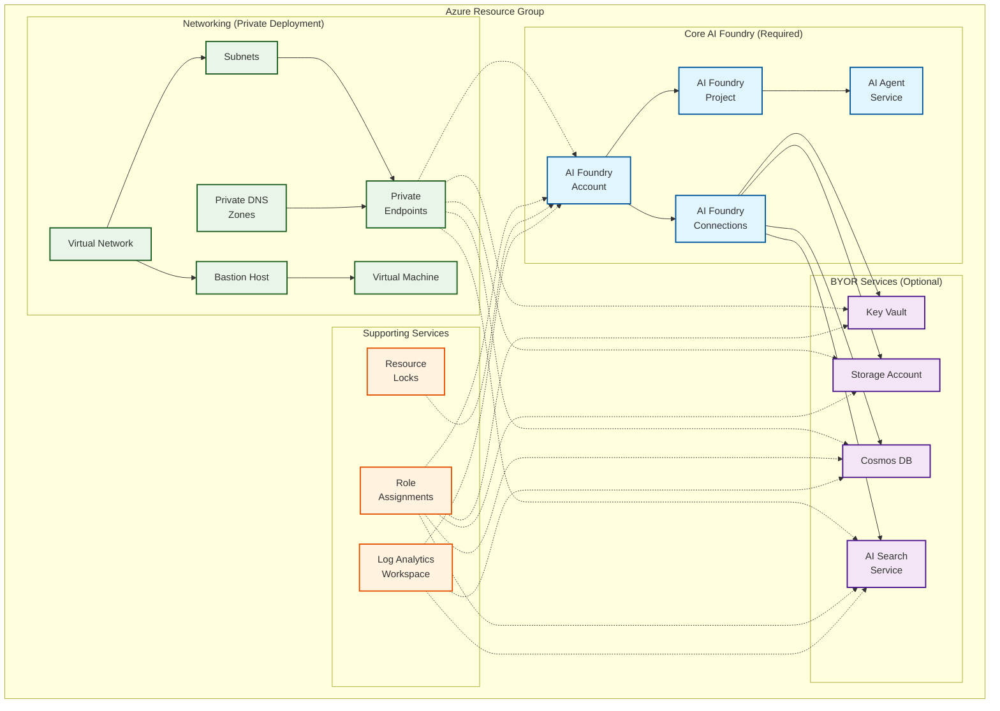

<!-- BEGIN_TF_DOCS -->
<!-- Code generated by terraform-docs. DO NOT EDIT. -->
# Azure AI Foundry Pattern Module

This Azure Verified Module (AVM) deploys Azure AI Foundry along with essential and optional supporting services to enable scalable AI application development. It provisions core resources such as the AI Foundry account, projects, agent service, RBACs, and resource locks, which are always deployed for baseline functionality. The module also supports supplemental infrastructure, like networking, compute, and monitoring, through dependent resources, and offers flexibility to either deploy or integrate existing services (BYOR) such as Key Vault, Storage Account, Cosmos DB, and AI Search. These BYOR resources can be provided externally or deployed via the module itself. Example deployment configurations range from minimal public setups to enterprise-grade private environments with VNet isolation and Bastion access, ensuring adaptability across different workload and security requirements.

## Architecture

The following diagram illustrates the key Azure services and components deployed by this pattern module:



**Legend:**
- 🔷 **Blue (Required)**: Core resources always deployed by this module
- 🔶 **Purple (BYOR)**: Optional services that can be deployed by the module or brought from existing infrastructure  
- 🔷 **Green (Dependent)**: Infrastructure components typically deployed in example configurations
- 🔶 **Orange (Support)**: Management and monitoring resources

## Resource Classification

- **Required**: Core resources that are always deployed by this module to ensure baseline functionality of Azure AI Foundry. These include the AI Foundry account, projects, agent service, RBACs, and resource locks.

- **Dependent**: Infrastructure components that support the AI Foundry environment, typically deployed in example configurations. These include networking (e.g., virtual networks, subnets, private DNS zones), compute (e.g., virtual machines, Bastion), and monitoring (e.g., Log Analytics Workspace). These resources are not part of the core module but are necessary for full functionality in specific deployment scenarios. This module is designed to work seamlessly with the [AI Landing Zone Accelerator](https://github.com/Azure/terraform-azurerm-avm-ptn-aiml-landing-zone), which provides broader platform capabilities and complements the dependent infrastructure setup.

- **BYOR (Bring Your Own Resource)**: Optional services that can either be provisioned by this module or integrated as existing resources. These include Key Vault, Storage Account, Cosmos DB, and AI Search. Users can choose to deploy these via the module or reference pre-existing infrastructure to align with organizational standards or reuse existing assets.

## Resource Types

This module deploys resources in three categories:

| Type      | Resource                         | Code Location     | Code / Deployment Notes             |
| --------- | -------------------------------- | ----------------- | ----------------------------------- |
| Required  | AI Foundry                       | Root module       | Always deployed                     |
| Required  | AI Foundry Project               | Root module       | Always deployed                     |
| Required  | RBACs                            | Root module       | BYOR dependency                     |
| Optional  | AI Foundry Connections           | Root module       | BYOR dependency                     |
| Optional  | AI Foundry Project Connections   | Root module       | BYOR dependency                     |
| Optional  | AI Foundry Agent Service         | Root module       | Public deployment only              |
| Optional  | AI Foundry Project Agent Service | Root module       | Private deployment only             |
| Dependent | Virtual Network                  | Example main.tf   | Private deployment only             |
| Dependent | Subnets                          | Example main.tf   | Private deployment only             |
| Dependent | Private DNS Zones                | Example main.tf   | Private deployment only             |
| Dependent | Private DNS Zone vNet Links      | Example main.tf   | Private deployment only             |
| Dependent | Bastion                          | Example main.tf   | Private deployment only             |
| Dependent | Virtual Machine                  | Example main.tf   | Private deployment only             |
| Dependent | Log Analytics Workspace          | Example main.tf   | Private or Public deployment        |
| BYOR      | Key Vault                        | main.byor.tf      | Deployed via module (AVM) or BYOR   |
| BYOR      | Search Service                   | main.ai\_search.tf | Deployed via module (azapi) or BYOR |
| BYOR      | Storage Account                  | main.byor.tf      | Deployed via module (AVM) or BYOR   |
| BYOR      | CosmosDB                         | main.byor.tf      | Deployed via module (AVM) or BYOR   |

## Example Deployments

| Example                   | Description                                | Key Features                                      |
| ------------------------- | ------------------------------------------ | ------------------------------------------------- |
| **basic**                 | Minimal AI Foundry deployment              | AI Foundry + Project only, public access          |
| **standard-public**       | Full-featured public deployment            | All services, public endpoints, complete setup    |
| **standard-public-byor**  | Public deployment with existing resources  | Uses existing Storage/KeyVault/Cosmos/Search      |
| **standard-private**      | Enterprise-grade private deployment        | Private endpoints, VNet isolation, Bastion access |
| **standard-private-byor** | Private deployment with existing resources | Private + existing resources combination          |

<!-- markdownlint-disable MD033 -->
## Requirements

The following requirements are needed by this module:

- <a name="requirement_terraform"></a> [terraform](#requirement\_terraform) (>= 1.12, < 2.0)

- <a name="requirement_azapi"></a> [azapi](#requirement\_azapi) (~> 2.5)

- <a name="requirement_azurerm"></a> [azurerm](#requirement\_azurerm) (~> 4.38)

- <a name="requirement_modtm"></a> [modtm](#requirement\_modtm) (~> 0.3)

- <a name="requirement_random"></a> [random](#requirement\_random) (~> 3.7)

## Resources

The following resources are used by this module:

- [azapi_resource.ai_agent_capability_host](https://registry.terraform.io/providers/Azure/azapi/latest/docs/resources/resource) (resource)
- [azapi_resource.ai_foundry](https://registry.terraform.io/providers/Azure/azapi/latest/docs/resources/resource) (resource)
- [azapi_resource.ai_model_deployment](https://registry.terraform.io/providers/Azure/azapi/latest/docs/resources/resource) (resource)
- [azapi_resource.ai_search](https://registry.terraform.io/providers/Azure/azapi/latest/docs/resources/resource) (resource)
- [azurerm_monitor_diagnostic_setting.this_aisearch](https://registry.terraform.io/providers/hashicorp/azurerm/latest/docs/resources/monitor_diagnostic_setting) (resource)
- [azurerm_private_endpoint.ai_foundry](https://registry.terraform.io/providers/hashicorp/azurerm/latest/docs/resources/private_endpoint) (resource)
- [azurerm_private_endpoint.pe_aisearch](https://registry.terraform.io/providers/hashicorp/azurerm/latest/docs/resources/private_endpoint) (resource)
- [azurerm_role_assignment.foundry_role_assignments](https://registry.terraform.io/providers/hashicorp/azurerm/latest/docs/resources/role_assignment) (resource)
- [azurerm_role_assignment.this_aisearch](https://registry.terraform.io/providers/hashicorp/azurerm/latest/docs/resources/role_assignment) (resource)
- [modtm_telemetry.telemetry](https://registry.terraform.io/providers/azure/modtm/latest/docs/resources/telemetry) (resource)
- [random_string.resource_token](https://registry.terraform.io/providers/hashicorp/random/latest/docs/resources/string) (resource)
- [random_uuid.telemetry](https://registry.terraform.io/providers/hashicorp/random/latest/docs/resources/uuid) (resource)
- [azapi_client_config.telemetry](https://registry.terraform.io/providers/Azure/azapi/latest/docs/data-sources/client_config) (data source)
- [azurerm_client_config.current](https://registry.terraform.io/providers/hashicorp/azurerm/latest/docs/data-sources/client_config) (data source)
- [modtm_module_source.telemetry](https://registry.terraform.io/providers/azure/modtm/latest/docs/data-sources/module_source) (data source)

<!-- markdownlint-disable MD013 -->
## Required Inputs

The following input variables are required:

### <a name="input_base_name"></a> [base\_name](#input\_base\_name)

Description: The name prefix for the AI Foundry resources.

Type: `string`

### <a name="input_location"></a> [location](#input\_location)

Description: Azure region where the resource should be deployed.

Type: `string`

### <a name="input_resource_group_resource_id"></a> [resource\_group\_resource\_id](#input\_resource\_group\_resource\_id)

Description: The resource group resource id where the module resources will be deployed.

Type: `string`

## Optional Inputs

The following input variables are optional (have default values):

### <a name="input_ai_foundry"></a> [ai\_foundry](#input\_ai\_foundry)

Description: Configuration object for the Azure AI Foundry service to be created for AI workloads and model management.

- `name` - (Optional) The name of the AI Foundry service. If not provided, a name will be generated.
- `disable_local_auth` - (Optional) Whether to disable local authentication for the AI Foundry service. Default is false.
- `allow_project_management` - (Optional) Whether to allow project management capabilities in the AI Foundry service. Default is true.
- `public_network_access_enabled` - (Optional) Whether public network access is enabled. Default is true.
- `create_ai_agent_service` - (Optional) Whether to create an AI agent service as part of the AI Foundry deployment. Default is false.
- `network_injections` - (Optional) List of network injection configurations for the AI Foundry service.
  - `scenario` - (Optional) The scenario for the network injection. Default is "agent".
  - `subnetArmId` - The subnet ARM ID for the AI agent service.
  - `useMicrosoftManagedNetwork` - (Optional) Whether to use Microsoft managed network for the injection. Default is false.
- `private_dns_zone_resource_ids` - (Optional) The resource IDs of the existing private DNS zones for AI Foundry. Required when `create_private_endpoints` is true.
- `sku` - (Optional) The SKU of the AI Foundry service. Default is "S0".
- `role_assignments` - (Optional) Map of role assignments to create on the AI Foundry service. The map key is deliberately arbitrary to avoid issues where map keys may be unknown at plan time.
  - `role_definition_id_or_name` - The role definition ID or name to assign.
  - `principal_id` - The principal ID to assign the role to.
  - `description` - (Optional) Description of the role assignment.
  - `skip_service_principal_aad_check` - (Optional) Whether to skip AAD check for service principal.
  - `condition` - (Optional) Condition for the role assignment.
  - `condition_version` - (Optional) Version of the condition.
  - `delegated_managed_identity_resource_id` - (Optional) Resource ID of the delegated managed identity.
  - `principal_type` - (Optional) Type of the principal (User, Group, ServicePrincipal).

Type:

```hcl
object({
    name                          = optional(string, null)
    disable_local_auth            = optional(bool, false)
    allow_project_management      = optional(bool, true)
    public_network_access_enabled = optional(bool, true)
    create_ai_agent_service       = optional(bool, false)
    network_injections = optional(list(object({
      scenario                   = optional(string, "agent")
      subnetArmId                = string
      useMicrosoftManagedNetwork = optional(bool, false)
    })), null)
    private_dns_zone_resource_ids = optional(list(string), [])
    sku                           = optional(string, "S0")
    role_assignments = optional(map(object({
      role_definition_id_or_name             = string
      principal_id                           = string
      description                            = optional(string, null)
      skip_service_principal_aad_check       = optional(bool, false)
      condition                              = optional(string, null)
      condition_version                      = optional(string, null)
      delegated_managed_identity_resource_id = optional(string, null)
      principal_type                         = optional(string, null)
    })), {})
  })
```

Default: `{}`

### <a name="input_ai_model_deployments"></a> [ai\_model\_deployments](#input\_ai\_model\_deployments)

Description: Configuration for AI model deployments (including OpenAI). Each deployment includes:
- `name` - The name of the deployment
- `rai_policy_name` - (Optional) The name of the RAI policy
- `version_upgrade_option` - (Optional) How to handle version upgrades (default: "OnceNewDefaultVersionAvailable")
- `model` - The model configuration:
  - `format` - The format of the model (e.g., "OpenAI")
  - `name` - The name of the model to deploy
  - `version` - The version of the model
- `scale` - The scaling configuration:
  - `type` - The scaling type (e.g., "Standard")
  - `capacity` - (Optional) The capacity of the deployment
  - `family` - (Optional) The family of the deployment
  - `size` - (Optional) The size of the deployment
  - `tier` - (Optional) The pricing tier for the deployment

Type:

```hcl
map(object({
    name                   = string
    rai_policy_name        = optional(string)
    version_upgrade_option = optional(string, "OnceNewDefaultVersionAvailable")
    model = object({
      format  = string
      name    = string
      version = string
    })
    scale = object({
      capacity = optional(number)
      family   = optional(string)
      size     = optional(string)
      tier     = optional(string)
      type     = string
    })
  }))
```

Default: `{}`

### <a name="input_ai_projects"></a> [ai\_projects](#input\_ai\_projects)

Description: Configuration map for AI Foundry projects to be created. Each project can have its own settings and connections to dependent resources.

- `map key` - The key for the map entry. This key should match the dependent resources keys when creating connections.
  - `name` - The name of the AI Foundry project.
  - `sku` - (Optional) The SKU of the AI Foundry project. Default is "S0".
  - `display_name` - The display name of the AI Foundry project.
  - `description` - The description of the AI Foundry project.
  - `create_project_connections` - (Optional) Whether to create connections to dependent resources. Default is false.
  - `cosmos_db_connection` - (Optional) Configuration for Cosmos DB connection.
    - `existing_resource_id` - (Optional) The resource ID of an existing Cosmos DB account to connect to.
    - `new_resource_map_key` - (Optional) The map key of a new Cosmos DB account to be created and connected.
  - `ai_search_connection` - (Optional) Configuration for AI Search connection.
    - `existing_resource_id` - (Optional) The resource ID of an existing AI Search service to connect to.
    - `new_resource_map_key` - (Optional) The map key of a new AI Search service to be created and connected.
  - `key_vault_connection` - (Optional) Configuration for Key Vault connection.
    - `existing_resource_id` - (Optional) The resource ID of an existing Key Vault to connect to.
    - `new_resource_map_key` - (Optional) The map key of a new Key Vault to be created and connected.
  - `storage_account_connection` - (Optional) Configuration for Storage Account connection.
    - `existing_resource_id` - (Optional) The resource ID of an existing Storage Account to connect to.
    - `new_resource_map_key` - (Optional) The map key of a new Storage Account to be created and connected.
  - `additional_storage_connections` - (Optional) Map of additional storage connections. Each entry can either use an existing storage account or create a new one (same shape as `storage_account_definition`):
    - `use_existing` - (Optional) Whether to use an existing storage account. Default is true.
    - `existing_resource_id` - (Optional) Resource ID of an existing storage account (required if `use_existing` is true).
    - `name_override` - (Optional) Explicit connection name; defaults to the map key.
    - `new_storage_account` - (Optional) Settings to create a new storage account when `use_existing` is false. Mirrors `storage_account_definition` (name, SKU, replication, endpoints, access tier, shared access keys, role assignments, tags, diagnostic settings).
  - `additional_connections` - (Optional) Map of extra AI Foundry project connections (e.g., API key, custom key, SharePoint) using the connections API. Keys become connection names unless `name_override` is set.
    - `category` - (Required) Connection category (see AI Foundry docs).
    - `target` - (Required) Target endpoint URL.
    - `auth_type` - (Required) Authentication type for the connection. Shapes follow the [connections API](https://learn.microsoft.com/en-us/azure/templates/microsoft.cognitiveservices/accounts/projects/connections?pivots=deployment-language-terraform): for example `ApiKey`/`AccountKey`/`PAT`/`SAS` expect a single field (`key`, `pat`, `sas`), `ServicePrincipal`/`OAuth2`/`UsernamePassword` expect the corresponding named fields, and `CustomKeys` expects `credentials.keys`.
    - `metadata` - (Optional) Key/value metadata for the connection (for example `ApiType`, `ResourceId`, `location`).
    - `credentials` - (Optional) Key/value secret material (marked sensitive upstream). When a Key Vault is configured (either globally via `additional_connections_key_vault` or per-connection via `key_vault_secret`), each value is treated as a Key Vault secret name resolved from that vault; otherwise values are used as provided. For `auth_type = "CustomKeys"` these entries are placed under `credentials.keys`.
    - `key_vault_secret` - (Optional) Source credentials from Key Vault instead of inline secrets. Provide vault name, resource group, secret name, and optional credential key name (defaults to "key"). For `CustomKeys` auth types, the Key Vault value is added to `credentials.keys[credential_key]`, and any `credentials` map values are resolved as secret names in the same vault.
    - `api_version` - (Optional) Override the connections API version; defaults to `2025-04-01-preview`.
    - `schema_validation_enabled` - (Optional) Whether to enable schema validation for this connection; defaults to false.
    - `name_override` - (Optional) Explicit connection name; defaults to the map key.
  - `additional_connections_key_vault` - (Optional) Shared Key Vault used to resolve all `credentials` entries in `additional_connections` (when a per-connection `key_vault_secret` is not provided). Specify `key_vault_name`, `resource_group_name`, and optional `secret_version`.

Type:

```hcl
map(object({
    name                       = string
    sku                        = optional(string, "S0")
    display_name               = string
    description                = string
    create_project_connections = optional(bool, false)
    cosmos_db_connection = optional(object({
      existing_resource_id = optional(string, null)
      new_resource_map_key = optional(string, null)
    }), {})
    ai_search_connection = optional(object({
      existing_resource_id = optional(string, null)
      new_resource_map_key = optional(string, null)
    }), {})
    key_vault_connection = optional(object({
      existing_resource_id = optional(string, null)
      new_resource_map_key = optional(string, null)
    }), {})
    storage_account_connection = optional(object({
      existing_resource_id = optional(string, null)
      new_resource_map_key = optional(string, null)
    }), {})
    additional_storage_connections = optional(map(object({
      use_existing         = optional(bool, true)
      existing_resource_id = optional(string, null)
      name_override        = optional(string, null)
      new_storage_account = optional(object({
        enable_diagnostic_settings = optional(bool, true)
        name                       = optional(string, null)
        account_kind               = optional(string, "StorageV2")
        account_tier               = optional(string, "Standard")
        account_replication_type   = optional(string, "ZRS")
        endpoints = optional(map(object({
          type                         = string
          private_dns_zone_resource_id = optional(string, null)
        })), {
          blob = {
            type = "blob"
          }
        })
        access_tier               = optional(string, "Hot")
        shared_access_key_enabled = optional(bool, false)
        role_assignments = optional(map(object({
          role_definition_id_or_name             = string
          principal_id                           = string
          description                            = optional(string, null)
          skip_service_principal_aad_check       = optional(bool, false)
          condition                              = optional(string, null)
          condition_version                      = optional(string, null)
          delegated_managed_identity_resource_id = optional(string, null)
          principal_type                         = optional(string, null)
        })), {})
        tags = optional(map(string), {})
      }), null)
    })), {})
    additional_connections = optional(map(object({
      category      = string
      target        = string
      auth_type     = string
      metadata      = optional(map(string), {})
      credentials   = optional(map(string))
      name_override = optional(string)
      api_version   = optional(string, "2025-04-01-preview")
      schema_validation_enabled = optional(bool, false)
      key_vault_secret = optional(object({
        key_vault_name      = string
        resource_group_name = string
        secret_name         = string
        secret_version      = optional(string)
        credential_key      = optional(string, "key")
      }))
    })), {})
    additional_connections_key_vault = optional(object({
      key_vault_name      = string
      resource_group_name = string
      secret_version      = optional(string)
    }), null)
  }))
```

Default: `{}`

Example additional connections (values pulled from the AI Foundry connections docs):

```hcl
ai_projects = {
  demo = {
    name         = "demo-project"
    display_name = "Demo Project"
    description  = "Shows custom connection types"

    create_project_connections = true
    additional_connections_key_vault = {
      key_vault_name      = "kv-shared-secrets"
      resource_group_name = "rg-shared"
    }

    additional_storage_connections = {
      extra_storage = {
        use_existing  = false
        name_override = "extra-storage-conn"
        new_storage_account = {
          name                       = "extrastorage001"
          account_replication_type   = "LRS"
          enable_diagnostic_settings = true
          endpoints = {
            blob = {
              type = "blob"
            }
          }
          tags = {
            env = "demo"
          }
        }
      }
    }

    additional_connections = {
      api_key_service = {
        category    = "ApiKey"
        target      = "https://example.com"
        auth_type   = "ApiKey"
        credentials = { key = "example-api-key" } # secret name in kv-shared-secrets
        metadata    = { ApiType = "Custom" }
      }
      custom_keys = {
        category    = "CustomKeys"
        target      = "https://contoso.cognitiveservices.azure.com"
        auth_type   = "CustomKeys"
        credentials = {
          primary   = "primary-custom-key"   # treated as KV secret names
          secondary = "secondary-custom-key" # treated as KV secret names
        }
        metadata = { ResourceId = "/subscriptions/.../resourceGroups/.../providers/..." }
      }
      sharepoint = {
        category    = "SharePoint"
        target      = "https://contoso.sharepoint.com/sites/ai"
        auth_type   = "ServicePrincipal"
        key_vault_secret = {
          key_vault_name      = "kv-shared-secrets"
          resource_group_name = "rg-shared"
          secret_name         = "sp-client-secret"
          credential_key      = "clientSecret"
        }
        credentials = {
          tenantId = var.tenant_id
          clientId = var.sp_client_id
        }
        metadata      = { ApiType = "Graph" }
        name_override = "sharepoint-connection"
      }
    }
  }
}
```

Key Vault lookups populate the credentials object (or `credentials.keys` for `CustomKeys` auth types) without inlining secrets; `credential_key` sets the name used inside that object (default `"key"`). When `additional_connections_key_vault` (project-level) or `key_vault_secret` (per-connection) is provided, any values in `credentials` are treated as secret names from that vault. You can still supply other non-secret credential fields alongside the Key Vault-sourced value.

### <a name="input_ai_search_definition"></a> [ai\_search\_definition](#input\_ai\_search\_definition)

Description: Configuration object for the Azure AI Search service to be created as part of the enterprise and public knowledge services.

- `map key` - The key for the map entry. This key should match the AI project key when creating multiple projects with multiple AI search services.
  - `existing_resource_id` - (Optional) The resource ID of an existing AI Search service to use. If provided, the service will not be created and the other inputs will be ignored.
  - `name` - (Optional) The name of the AI Search service. If not provided, a name will be generated.
  - `private_dns_zone_resource_id` - (Optional) The resource ID of the existing private DNS zone for AI Search. If not provided, a private endpoint will not be created.
  - `enable_diagnostic_settings` - (Optional) Whether diagnostic settings are enabled. Default is true.
  - `sku` - (Optional) The SKU of the AI Search service. Default is "standard".
  - `local_authentication_enabled` - (Optional) Whether local authentication is enabled. Default is true.
  - `partition_count` - (Optional) The number of partitions for the search service. Default is 1.
  - `replica_count` - (Optional) The number of replicas for the search service. Default is 2.
  - `semantic_search_sku` - (Optional) The SKU for semantic search capabilities. Default is "standard".
  - `semantic_search_enabled` - (Optional) Whether semantic search is enabled. Default is false.
  - `hosting_mode` - (Optional) The hosting mode for the search service. Default is "default".
  - `tags` - (Optional) Map of tags to assign to the AI Search service.
  - `role_assignments` - (Optional) Map of role assignments to create on the AI Search service. The map key is deliberately arbitrary to avoid issues where map keys may be unknown at plan time.
    - `role_definition_id_or_name` - The role definition ID or name to assign.
    - `principal_id` - The principal ID to assign the role to.
    - `description` - (Optional) Description of the role assignment.
    - `skip_service_principal_aad_check` - (Optional) Whether to skip AAD check for service principal.
    - `condition` - (Optional) Condition for the role assignment.
    - `condition_version` - (Optional) Version of the condition.
    - `delegated_managed_identity_resource_id` - (Optional) Resource ID of the delegated managed identity.
    - `principal_type` - (Optional) Type of the principal (User, Group, ServicePrincipal).
  - `enable_telemetry` - (Optional) Whether telemetry is enabled for the AI Search module. Default is true.

Type:

```hcl
map(object({
    existing_resource_id         = optional(string, null)
    name                         = optional(string)
    private_dns_zone_resource_id = optional(string, null)
    enable_diagnostic_settings   = optional(bool, true)
    sku                          = optional(string, "standard")
    local_authentication_enabled = optional(bool, true)
    partition_count              = optional(number, 1)
    replica_count                = optional(number, 2)
    semantic_search_sku          = optional(string, "standard")
    semantic_search_enabled      = optional(bool, false)
    hosting_mode                 = optional(string, "default")
    tags                         = optional(map(string), {})
    role_assignments = optional(map(object({
      role_definition_id_or_name             = string
      principal_id                           = string
      description                            = optional(string, null)
      skip_service_principal_aad_check       = optional(bool, false)
      condition                              = optional(string, null)
      condition_version                      = optional(string, null)
      delegated_managed_identity_resource_id = optional(string, null)
      principal_type                         = optional(string, null)
    })), {})
    enable_telemetry = optional(bool, true)
  }))
```

Default: `{}`

### <a name="input_cosmosdb_definition"></a> [cosmosdb\_definition](#input\_cosmosdb\_definition)

Description: Configuration object for the Azure Cosmos DB account to be created for GenAI services.

- `map key` - The key for the map entry. This key should match the AI project key when creating multiple projects and multiple CosmosDB accounts.
  - `existing_resource_id` - (Optional) The resource ID of an existing Cosmos DB account to use. If provided, the account will not be created and the other inputs will be ignored.
  - `private_dns_zone_resource_id` - (Optional) The resource ID of the existing private DNS zone for Cosmos DB. If one is not provided a private endpoint will not be created.
  - `enable_diagnostic_settings` - (Optional) Whether diagnostic settings are enabled. Default is true.
  - `name` - (Optional) The name of the Cosmos DB account. If not provided, a name will be generated.
  - `secondary_regions` - (Optional) List of secondary regions for geo-replication.
    - `location` - The Azure region for the secondary location.
    - `zone_redundant` - (Optional) Whether zone redundancy is enabled for the secondary region. Default is true.
    - `failover_priority` - (Optional) The failover priority for the secondary region. Default is 0.
  - `public_network_access_enabled` - (Optional) Whether public network access is enabled. Default is false.
  - `analytical_storage_enabled` - (Optional) Whether analytical storage is enabled. Default is true.
  - `automatic_failover_enabled` - (Optional) Whether automatic failover is enabled. Default is false.
  - `local_authentication_disabled` - (Optional) Whether local authentication is disabled. Default is true.
  - `partition_merge_enabled` - (Optional) Whether partition merge is enabled. Default is false.
  - `multiple_write_locations_enabled` - (Optional) Whether multiple write locations are enabled. Default is false.
  - `analytical_storage_config` - (Optional) Analytical storage configuration.
    - `schema_type` - The schema type for analytical storage.
  - `consistency_policy` - (Optional) Consistency policy configuration.
    - `max_interval_in_seconds` - (Optional) Maximum staleness interval in seconds. Default is 300.
    - `max_staleness_prefix` - (Optional) Maximum staleness prefix. Default is 100001.
    - `consistency_level` - (Optional) The consistency level. Default is "Session".
  - `backup` - (Optional) Backup configuration.
    - `retention_in_hours` - (Optional) Backup retention in hours.
    - `interval_in_minutes` - (Optional) Backup interval in minutes.
    - `storage_redundancy` - (Optional) Storage redundancy for backups.
    - `type` - (Optional) The backup type.
    - `tier` - (Optional) The backup tier.
  - `capabilities` - (Optional) Set of capabilities to enable on the Cosmos DB account.
    - `name` - The name of the capability.
  - `capacity` - (Optional) Capacity configuration.
    - `total_throughput_limit` - (Optional) Total throughput limit. Default is -1 (unlimited).
  - `cors_rule` - (Optional) CORS rule configuration.
    - `allowed_headers` - Set of allowed headers.
    - `allowed_methods` - Set of allowed HTTP methods.
    - `allowed_origins` - Set of allowed origins.
    - `exposed_headers` - Set of exposed headers.
    - `max_age_in_seconds` - (Optional) Maximum age in seconds for CORS.
  - `role_assignments` - (Optional) Map of role assignments to create on the Cosmos DB account. The map key is deliberately arbitrary to avoid issues where map keys may be unknown at plan time.
    - `role_definition_id_or_name` - The role definition ID or name to assign.
    - `principal_id` - The principal ID to assign the role to.
    - `description` - (Optional) Description of the role assignment.
    - `skip_service_principal_aad_check` - (Optional) Whether to skip AAD check for service principal.
    - `condition` - (Optional) Condition for the role assignment.
    - `condition_version` - (Optional) Version of the condition.
    - `delegated_managed_identity_resource_id` - (Optional) Resource ID of the delegated managed identity.
    - `principal_type` - (Optional) Type of the principal (User, Group, ServicePrincipal).
  - `tags` - (Optional) Map of tags to assign to the Cosmos DB account.

Type:

```hcl
map(object({
    existing_resource_id         = optional(string, null)
    private_dns_zone_resource_id = optional(string, null)
    enable_diagnostic_settings   = optional(bool, true)
    name                         = optional(string)
    secondary_regions = optional(list(object({
      location          = string
      zone_redundant    = optional(bool, true)
      failover_priority = optional(number, 0)
    })), [])
    public_network_access_enabled    = optional(bool, false)
    analytical_storage_enabled       = optional(bool, true)
    automatic_failover_enabled       = optional(bool, true)
    local_authentication_disabled    = optional(bool, true)
    partition_merge_enabled          = optional(bool, false)
    multiple_write_locations_enabled = optional(bool, false)
    analytical_storage_config = optional(object({
      schema_type = string
    }), null)
    consistency_policy = optional(object({
      max_interval_in_seconds = optional(number, 300)
      max_staleness_prefix    = optional(number, 100001)
      consistency_level       = optional(string, "Session")
    }), {})
    backup = optional(object({
      retention_in_hours  = optional(number)
      interval_in_minutes = optional(number)
      storage_redundancy  = optional(string)
      type                = optional(string)
      tier                = optional(string)
    }), {})
    capabilities = optional(set(object({
      name = string
    })), [])
    capacity = optional(object({
      total_throughput_limit = optional(number, -1)
    }), {})
    cors_rule = optional(object({
      allowed_headers    = set(string)
      allowed_methods    = set(string)
      allowed_origins    = set(string)
      exposed_headers    = set(string)
      max_age_in_seconds = optional(number, null)
    }), null)
    role_assignments = optional(map(object({
      role_definition_id_or_name             = string
      principal_id                           = string
      description                            = optional(string, null)
      skip_service_principal_aad_check       = optional(bool, false)
      condition                              = optional(string, null)
      condition_version                      = optional(string, null)
      delegated_managed_identity_resource_id = optional(string, null)
      principal_type                         = optional(string, null)
    })), {})
    tags = optional(map(string), {})
  }))
```

Default: `{}`

### <a name="input_create_byor"></a> [create\_byor](#input\_create\_byor)

Description: Whether to create resources such as AI Search, Cosmos DB, Key Vault, and Storage Account in this deployment. If set to false, these resources will not be created or linked, and the module will only create the AI Foundry account and project.

Type: `bool`

Default: `false`

### <a name="input_create_private_endpoints"></a> [create\_private\_endpoints](#input\_create\_private\_endpoints)

Description: Whether to create private endpoints for AI Foundry, Cosmos DB, Key Vault, and AI Search. If set to false, private endpoints will not be created.

Type: `bool`

Default: `false`

### <a name="input_enable_telemetry"></a> [enable\_telemetry](#input\_enable\_telemetry)

Description: This variable controls whether or not telemetry is enabled for the module.  
For more information see <https://aka.ms/avm/telemetryinfo>.  
If it is set to false, then no telemetry will be collected.

Type: `bool`

Default: `true`

### <a name="input_key_vault_definition"></a> [key\_vault\_definition](#input\_key\_vault\_definition)

Description: Configuration object for the Azure Key Vault to be created for GenAI services.

- `map key` - The key for the map entry. This key should match the AI project key when creating multiple projects with multiple Key Vaults. This can be used in naming, so short alphanumeric keys are required to avoid hitting naming length limits for the Key Vault when using the base name naming option.
  - `existing_resource_id` - (Optional) The resource ID of an existing Key Vault to use. If provided, the vault will not be created and the other inputs will be ignored.
  - `name` - (Optional) The name of the Key Vault. If not provided, a name will be generated.
  - `private_dns_zone_resource_id` - (Optional) The resource ID of the existing private DNS zone for Key Vault. If one is not provided a private endpoint will not be created.
  - `enable_diagnostic_settings` - (Optional) Whether diagnostic settings are enabled. Default is true.
  - `sku` - (Optional) The SKU of the Key Vault. Default is "standard".
  - `tenant_id` - (Optional) The tenant ID for the Key Vault. If not provided, the current tenant will be used.
  - `role_assignments` - (Optional) Map of role assignments to create on the Key Vault. The map key is deliberately arbitrary to avoid issues where map keys may be unknown at plan time.
    - `role_definition_id_or_name` - The role definition ID or name to assign.
    - `principal_id` - The principal ID to assign the role to.
    - `description` - (Optional) Description of the role assignment.
    - `skip_service_principal_aad_check` - (Optional) Whether to skip AAD check for service principal.
    - `condition` - (Optional) Condition for the role assignment.
    - `condition_version` - (Optional) Version of the condition.
    - `delegated_managed_identity_resource_id` - (Optional) Resource ID of the delegated managed identity.
    - `principal_type` - (Optional) Type of the principal (User, Group, ServicePrincipal).
  - `tags` - (Optional) Map of tags to assign to the Key Vault.

Type:

```hcl
map(object({
    existing_resource_id         = optional(string, null)
    name                         = optional(string)
    private_dns_zone_resource_id = optional(string, null)
    enable_diagnostic_settings   = optional(bool, true)
    sku                          = optional(string, "standard")
    tenant_id                    = optional(string)
    role_assignments = optional(map(object({
      role_definition_id_or_name             = string
      principal_id                           = string
      description                            = optional(string, null)
      skip_service_principal_aad_check       = optional(bool, false)
      condition                              = optional(string, null)
      condition_version                      = optional(string, null)
      delegated_managed_identity_resource_id = optional(string, null)
      principal_type                         = optional(string, null)
    })), {})
    tags = optional(map(string), {})
  }))
```

Default: `{}`

### <a name="input_law_definition"></a> [law\_definition](#input\_law\_definition)

Description: Configuration object for the Log Analytics Workspace to be created for monitoring and logging.

- `map key` - The key for the map entry. This key should match the AI project key when creating multiple projects with multiple Log Analytics Workspaces.
  - `existing_resource_id` - (Optional) The resource ID of an existing Log Analytics Workspace to use. If provided, the workspace will not be created and the other inputs will be ignored.
  - `name` - (Optional) The name of the Log Analytics Workspace. If not provided, a name will be generated.
  - `retention` - (Optional) The data retention period in days for the workspace. Default is 30.
  - `sku` - (Optional) The SKU of the Log Analytics Workspace. Default is "PerGB2018".
  - `tags` - (Optional) Map of tags to assign to the Log Analytics Workspace.

Type:

```hcl
map(object({
    existing_resource_id = optional(string, null)
    name                 = optional(string)
    retention            = optional(number, 30)
    sku                  = optional(string, "PerGB2018")
    tags                 = optional(map(string), {})
  }))
```

Default: `{}`

### <a name="input_private_endpoint_subnet_resource_id"></a> [private\_endpoint\_subnet\_resource\_id](#input\_private\_endpoint\_subnet\_resource\_id)

Description: (Optional) The subnet ID for private endpoints.

Type: `string`

Default: `null`

### <a name="input_resource_names"></a> [resource\_names](#input\_resource\_names)

Description: Custom names for each resource. If not provided, names will be generated using base\_name or name.

Type:

```hcl
object({
    ai_agent_host                   = optional(string)
    ai_foundry                      = optional(string)
    ai_foundry_project              = optional(string)
    ai_foundry_project_display_name = optional(string)
  })
```

Default: `{}`

### <a name="input_storage_account_definition"></a> [storage\_account\_definition](#input\_storage\_account\_definition)

Description: Configuration object for the Azure Storage Account to be created for GenAI services.

- `map key` - The key for the map entry. This key should match the AI project key when creating multiple projects with multiple Storage Accounts. This can be used in naming, so short alphanumeric keys are required to avoid hitting naming length limits for the Storage Account when using the base name naming option.
  - `existing_resource_id` - (Optional) The resource ID of an existing Storage Account to use. If provided, the account will not be created and the other inputs will be ignored.
  - `enable_diagnostic_settings` - (Optional) Whether diagnostic settings are enabled. Default is true.
  - `name` - (Optional) The name of the Storage Account. If not provided, a name will be generated.
  - `account_kind` - (Optional) The kind of storage account. Default is "StorageV2".
  - `account_tier` - (Optional) The performance tier of the storage account. Default is "Standard".
  - `account_replication_type` - (Optional) The replication type for the storage account. Default is "ZRS".
  - `endpoints` - (Optional) Map of endpoint configurations to enable. Default includes blob endpoint.
    - `type` - The type of endpoint (e.g., "blob", "file", "queue", "table").
    - `private_dns_zone_resource_id` - (Optional) The resource ID of the existing private DNS zone for the endpoint. If not provided, a private endpoint will not be created.
  - `access_tier` - (Optional) The access tier for the storage account. Default is "Hot".
  - `shared_access_key_enabled` - (Optional) Whether shared access keys are enabled. Default is false.
  - `role_assignments` - (Optional) Map of role assignments to create on the Storage Account. The map key is deliberately arbitrary to avoid issues where map keys may be unknown at plan time.
    - `role_definition_id_or_name` - The role definition ID or name to assign.
    - `principal_id` - The principal ID to assign the role to.
    - `description` - (Optional) Description of the role assignment.
    - `skip_service_principal_aad_check` - (Optional) Whether to skip AAD check for service principal.
    - `condition` - (Optional) Condition for the role assignment.
    - `condition_version` - (Optional) Version of the condition.
    - `delegated_managed_identity_resource_id` - (Optional) Resource ID of the delegated managed identity.
    - `principal_type` - (Optional) Type of the principal (User, Group, ServicePrincipal).
  - `tags` - (Optional) Map of tags to assign to the Storage Account.

Type:

```hcl
map(object({
    existing_resource_id       = optional(string, null)
    enable_diagnostic_settings = optional(bool, true)
    name                       = optional(string, null)
    account_kind               = optional(string, "StorageV2")
    account_tier               = optional(string, "Standard")
    account_replication_type   = optional(string, "ZRS")
    endpoints = optional(map(object({
      type                         = string
      private_dns_zone_resource_id = optional(string, null)
      })), {
      blob = {
        type = "blob"
      }
    })
    access_tier               = optional(string, "Hot")
    shared_access_key_enabled = optional(bool, false)
    role_assignments = optional(map(object({
      role_definition_id_or_name             = string
      principal_id                           = string
      description                            = optional(string, null)
      skip_service_principal_aad_check       = optional(bool, false)
      condition                              = optional(string, null)
      condition_version                      = optional(string, null)
      delegated_managed_identity_resource_id = optional(string, null)
      principal_type                         = optional(string, null)
    })), {})
    tags = optional(map(string), {})

    #TODO:
    # Implement subservice passthrough here
  }))
```

Default: `{}`

### <a name="input_tags"></a> [tags](#input\_tags)

Description: (Optional) Tags to be applied to all resources.

Type: `map(string)`

Default: `null`

## Outputs

The following outputs are exported:

### <a name="output_ai_agent_account_capability_host_id"></a> [ai\_agent\_account\_capability\_host\_id](#output\_ai\_agent\_account\_capability\_host\_id)

Description: The resource ID of the account-level AI agent capability host.

### <a name="output_ai_agent_service_id"></a> [ai\_agent\_service\_id](#output\_ai\_agent\_service\_id)

Description: The resource ID of the AI agent capability host.

### <a name="output_ai_foundry_id"></a> [ai\_foundry\_id](#output\_ai\_foundry\_id)

Description: The resource ID of the AI Foundry account.

### <a name="output_ai_foundry_name"></a> [ai\_foundry\_name](#output\_ai\_foundry\_name)

Description: The name of the AI Foundry account.

### <a name="output_ai_foundry_project_id"></a> [ai\_foundry\_project\_id](#output\_ai\_foundry\_project\_id)

Description: The resource ID of the AI Foundry Project.

### <a name="output_ai_foundry_project_internal_id"></a> [ai\_foundry\_project\_internal\_id](#output\_ai\_foundry\_project\_internal\_id)

Description: The internal ID of the AI Foundry project used for container naming.

### <a name="output_ai_foundry_project_name"></a> [ai\_foundry\_project\_name](#output\_ai\_foundry\_project\_name)

Description: The name of the AI Foundry Project.

### <a name="output_ai_foundry_project_system_identity_principal_id"></a> [ai\_foundry\_project\_system\_identity\_principal\_id](#output\_ai\_foundry\_project\_system\_identity\_principal\_id)

Description: The principal ID of the AI Foundry project's system-assigned managed identity.

### <a name="output_ai_model_deployment_ids"></a> [ai\_model\_deployment\_ids](#output\_ai\_model\_deployment\_ids)

Description: The resource IDs of all AI model deployments.

### <a name="output_ai_search_id"></a> [ai\_search\_id](#output\_ai\_search\_id)

Description: The resource ID of the AI Search service.

### <a name="output_ai_search_name"></a> [ai\_search\_name](#output\_ai\_search\_name)

Description: The name of the AI Search service.

### <a name="output_cosmos_db_id"></a> [cosmos\_db\_id](#output\_cosmos\_db\_id)

Description: The resource ID of the Cosmos DB account.

### <a name="output_cosmos_db_name"></a> [cosmos\_db\_name](#output\_cosmos\_db\_name)

Description: The name of the Cosmos DB account.

### <a name="output_key_vault_id"></a> [key\_vault\_id](#output\_key\_vault\_id)

Description: The resource ID of the Key Vault.

### <a name="output_key_vault_name"></a> [key\_vault\_name](#output\_key\_vault\_name)

Description: The name of the Key Vault.

### <a name="output_project_id_guid"></a> [project\_id\_guid](#output\_project\_id\_guid)

Description: The project ID formatted as GUID for container naming (only available when AI agent service is enabled).

### <a name="output_resource_group_id"></a> [resource\_group\_id](#output\_resource\_group\_id)

Description: The resource ID of the resource group.

### <a name="output_resource_group_name"></a> [resource\_group\_name](#output\_resource\_group\_name)

Description: The name of the resource group.

### <a name="output_resource_id"></a> [resource\_id](#output\_resource\_id)

Description: The resource IDs of the AI Foundry resource.

### <a name="output_storage_account_id"></a> [storage\_account\_id](#output\_storage\_account\_id)

Description: The resource ID of the storage account.

### <a name="output_storage_account_name"></a> [storage\_account\_name](#output\_storage\_account\_name)

Description: The name of the storage account.

## Modules

The following Modules are called:

### <a name="module_ai_foundry_project"></a> [ai\_foundry\_project](#module\_ai\_foundry\_project)

Source: ./modules/ai-foundry-project

Version:

### <a name="module_avm_utl_regions"></a> [avm\_utl\_regions](#module\_avm\_utl\_regions)

Source: Azure/avm-utl-regions/azurerm

Version: 0.5.2

### <a name="module_cosmosdb"></a> [cosmosdb](#module\_cosmosdb)

Source: Azure/avm-res-documentdb-databaseaccount/azurerm

Version: 0.10.0

### <a name="module_key_vault"></a> [key\_vault](#module\_key\_vault)

Source: Azure/avm-res-keyvault-vault/azurerm

Version: 0.10.0

### <a name="module_log_analytics_workspace"></a> [log\_analytics\_workspace](#module\_log\_analytics\_workspace)

Source: Azure/avm-res-operationalinsights-workspace/azurerm

Version: 0.4.2

### <a name="module_storage_account"></a> [storage\_account](#module\_storage\_account)

Source: Azure/avm-res-storage-storageaccount/azurerm

Version: 0.6.4

<!-- markdownlint-disable-next-line MD041 -->
## Data Collection

The software may collect information about you and your use of the software and send it to Microsoft. Microsoft may use this information to provide services and improve our products and services. You may turn off the telemetry as described in the repository. There are also some features in the software that may enable you and Microsoft to collect data from users of your applications. If you use these features, you must comply with applicable law, including providing appropriate notices to users of your applications together with a copy of Microsoft’s privacy statement. Our privacy statement is located at <https://go.microsoft.com/fwlink/?LinkID=824704>. You can learn more about data collection and use in the help documentation and our privacy statement. Your use of the software operates as your consent to these practices.
<!-- END_TF_DOCS -->
