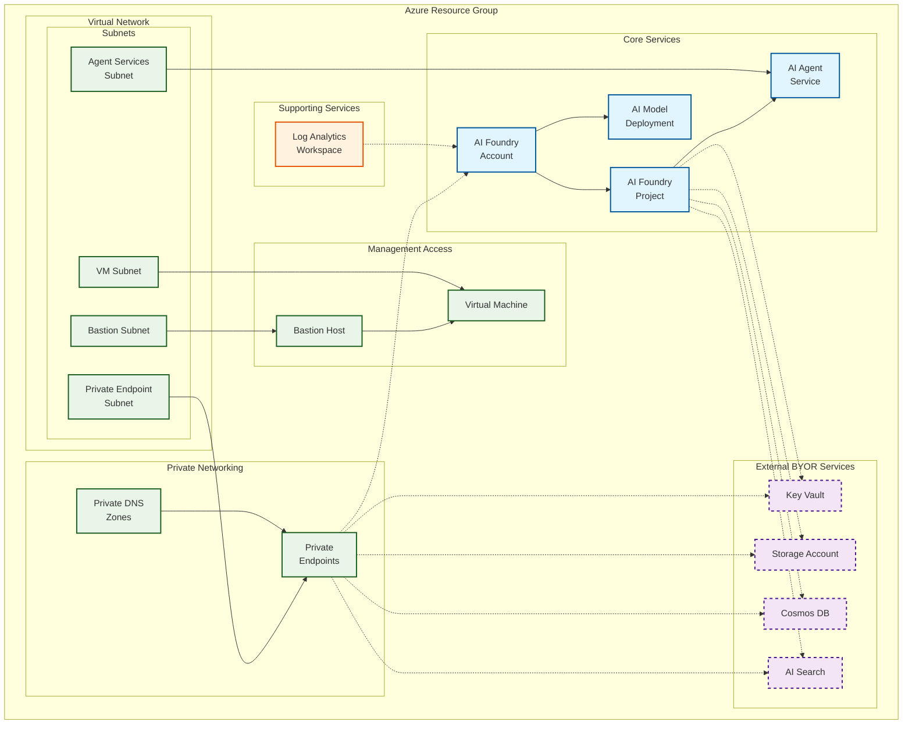

<!-- BEGIN_TF_DOCS -->
<!-- Code generated by terraform-docs. DO NOT EDIT. -->
# Private example

This example deploys a simple version of the module with private endpoints enabled.

## Architecture

This example uses externally created BYOR services with AI Foundry using private networking:



**Components:**
- 🔷 **Core AI Foundry** with private access and Agent Services
- 🔶 **External BYOR Services** (Key Vault, Storage, Cosmos DB, AI Search) - dashed borders indicate external resources
- 🔷 **Private Networking** with VNet isolation, dedicated subnets, and private endpoints
- 🔷 **Management Access** via Bastion Host and VM for secure administration
- 🔸 **Supporting Services** (Log Analytics Workspace)

This configuration demonstrates the most comprehensive deployment pattern using external BYOR services with full private networking and secure management access.

```hcl
terraform {
  required_version = ">= 1.9, < 2.0"

  required_providers {
    azapi = {
      source  = "Azure/azapi"
      version = "~> 2.0"
    }
    azurerm = {
      source  = "hashicorp/azurerm"
      version = "~> 4.0"
    }
    random = {
      source  = "hashicorp/random"
      version = "~> 3.5"
    }
    time = {
      source  = "hashicorp/time"
      version = "~> 0.12"
    }
  }
}

provider "azurerm" {
  storage_use_azuread = true
  features {
    resource_group {
      prevent_deletion_if_contains_resources = false
    }
    virtual_machine {
      delete_os_disk_on_deletion = true
    }
    cognitive_account {
      purge_soft_delete_on_destroy = true
    }
  }
}

# Get current subscription data
data "azurerm_client_config" "current" {}

module "regions" {
  source  = "Azure/avm-utl-regions/azurerm"
  version = "0.5.2"

  availability_zones_filter = true
  geography_filter          = "Australia"
}

resource "random_shuffle" "locations" {
  input        = module.regions.valid_region_names
  result_count = 3
}

locals {
  base_name = "pribyor"
}

module "naming" {
  source  = "Azure/naming/azurerm"
  version = "0.4.2"

  suffix        = [local.base_name]
  unique-length = 5
}

resource "azurerm_resource_group" "this" {
  location = random_shuffle.locations.result[0]
  name     = module.naming.resource_group.name_unique
}

# Virtual Network for private endpoints and agent services
resource "azurerm_virtual_network" "this" {
  location            = azurerm_resource_group.this.location
  name                = module.naming.virtual_network.name_unique
  resource_group_name = azurerm_resource_group.this.name
  address_space       = ["192.168.0.0/16"]
}

# Subnet for private endpoints
resource "azurerm_subnet" "private_endpoints" {
  address_prefixes     = ["192.168.1.0/24"]
  name                 = "snet-private-endpoints"
  resource_group_name  = azurerm_resource_group.this.name
  virtual_network_name = azurerm_virtual_network.this.name
}

# Subnet for AI agent services (Container Apps)
resource "azurerm_subnet" "agent_services" {
  address_prefixes     = ["192.168.0.0/24"]
  name                 = "snet-agent-services"
  resource_group_name  = azurerm_resource_group.this.name
  virtual_network_name = azurerm_virtual_network.this.name

  # Required for Container App Environment
  delegation {
    name = "Microsoft.App.environments"

    service_delegation {
      name    = "Microsoft.App/environments"
      actions = ["Microsoft.Network/virtualNetworks/subnets/join/action"]
    }
  }
}

# Subnet for Bastion
resource "azurerm_subnet" "bastion" {
  address_prefixes     = ["192.168.2.0/26"]
  name                 = "AzureBastionSubnet"
  resource_group_name  = azurerm_resource_group.this.name
  virtual_network_name = azurerm_virtual_network.this.name
}

# Subnet for VM
resource "azurerm_subnet" "vm" {
  address_prefixes     = ["192.168.3.0/26"]
  name                 = "snet-vm"
  resource_group_name  = azurerm_resource_group.this.name
  virtual_network_name = azurerm_virtual_network.this.name
}

# Storage Account Private DNS Zone
resource "azurerm_private_dns_zone" "storage_blob" {
  name                = "privatelink.blob.core.windows.net"
  resource_group_name = azurerm_resource_group.this.name
}

resource "azurerm_private_dns_zone_virtual_network_link" "storage_blob" {
  name                  = "vnet-link-storage-blob"
  private_dns_zone_name = azurerm_private_dns_zone.storage_blob.name
  resource_group_name   = azurerm_resource_group.this.name
  virtual_network_id    = azurerm_virtual_network.this.id
}

# Key Vault Private DNS Zone
resource "azurerm_private_dns_zone" "keyvault" {
  name                = "privatelink.vaultcore.azure.net"
  resource_group_name = azurerm_resource_group.this.name
}

resource "azurerm_private_dns_zone_virtual_network_link" "keyvault" {
  name                  = "vnet-link-keyvault"
  private_dns_zone_name = azurerm_private_dns_zone.keyvault.name
  resource_group_name   = azurerm_resource_group.this.name
  virtual_network_id    = azurerm_virtual_network.this.id
}

# Cosmos DB Private DNS Zone
resource "azurerm_private_dns_zone" "cosmosdb" {
  name                = "privatelink.documents.azure.com"
  resource_group_name = azurerm_resource_group.this.name
}

resource "azurerm_private_dns_zone_virtual_network_link" "cosmosdb" {
  name                  = "vnet-link-cosmosdb"
  private_dns_zone_name = azurerm_private_dns_zone.cosmosdb.name
  resource_group_name   = azurerm_resource_group.this.name
  virtual_network_id    = azurerm_virtual_network.this.id
}

# AI Search Private DNS Zone
resource "azurerm_private_dns_zone" "search" {
  name                = "privatelink.search.windows.net"
  resource_group_name = azurerm_resource_group.this.name
}

resource "azurerm_private_dns_zone_virtual_network_link" "search" {
  name                  = "vnet-link-search"
  private_dns_zone_name = azurerm_private_dns_zone.search.name
  resource_group_name   = azurerm_resource_group.this.name
  virtual_network_id    = azurerm_virtual_network.this.id
}

# Cognitive Services Private DNS Zone
resource "azurerm_private_dns_zone" "openai" {
  name                = "privatelink.openai.azure.com"
  resource_group_name = azurerm_resource_group.this.name
}

resource "azurerm_private_dns_zone_virtual_network_link" "openai" {
  name                  = "vnet-link-openai"
  private_dns_zone_name = azurerm_private_dns_zone.openai.name
  resource_group_name   = azurerm_resource_group.this.name
  virtual_network_id    = azurerm_virtual_network.this.id
}

# Cognitive Services General Private DNS Zone
resource "azurerm_private_dns_zone" "cognitiveservices" {
  name                = "privatelink.cognitiveservices.azure.com"
  resource_group_name = azurerm_resource_group.this.name
}

resource "azurerm_private_dns_zone_virtual_network_link" "cognitiveservices" {
  name                  = "vnet-link-cognitiveservices"
  private_dns_zone_name = azurerm_private_dns_zone.cognitiveservices.name
  resource_group_name   = azurerm_resource_group.this.name
  virtual_network_id    = azurerm_virtual_network.this.id
}

# Storage File Private DNS Zone
resource "azurerm_private_dns_zone" "storage_file" {
  name                = "privatelink.file.core.windows.net"
  resource_group_name = azurerm_resource_group.this.name
}

resource "azurerm_private_dns_zone_virtual_network_link" "storage_file" {
  name                  = "vnet-link-storage-file"
  private_dns_zone_name = azurerm_private_dns_zone.storage_file.name
  resource_group_name   = azurerm_resource_group.this.name
  virtual_network_id    = azurerm_virtual_network.this.id
}

# AI Services Private DNS Zone
resource "azurerm_private_dns_zone" "ai_services" {
  name                = "privatelink.services.ai.azure.com"
  resource_group_name = azurerm_resource_group.this.name
}

resource "azurerm_private_dns_zone_virtual_network_link" "ai_services" {
  name                  = "vnet-link-ai-services"
  private_dns_zone_name = azurerm_private_dns_zone.ai_services.name
  resource_group_name   = azurerm_resource_group.this.name
  virtual_network_id    = azurerm_virtual_network.this.id
}

# Bastion Host
resource "azurerm_public_ip" "example" {
  allocation_method   = "Static"
  location            = azurerm_resource_group.this.location
  name                = module.naming.public_ip.name_unique
  resource_group_name = azurerm_resource_group.this.name
  sku                 = "Standard"
  zones               = [1, 2, 3]
}

module "bastion_host" {
  source  = "Azure/avm-res-network-bastionhost/azurerm"
  version = "0.8.0"

  location            = azurerm_resource_group.this.location
  name                = module.naming.bastion_host.name_unique
  resource_group_name = azurerm_resource_group.this.name
  ip_configuration = {
    name                 = "default-ipconfig"
    subnet_id            = azurerm_subnet.bastion.id
    public_ip_address_id = azurerm_public_ip.example.id
    create_public_ip     = false
  }
  scale_units            = 2
  shareable_link_enabled = true
  sku                    = "Standard"
}

module "virtual_machine" {
  source  = "Azure/avm-res-compute-virtualmachine/azurerm"
  version = "0.19.3"

  location = azurerm_resource_group.this.location
  name     = module.naming.virtual_machine.name_unique
  network_interfaces = {
    network_interface_1 = {
      name = "${module.naming.network_interface.name_unique}-vm"
      ip_configurations = {
        ip_configuration_1 = {
          name                          = "internal"
          private_ip_subnet_resource_id = azurerm_subnet.vm.id
        }
      }
    }
  }
  resource_group_name                                    = azurerm_resource_group.this.name
  zone                                                   = "1"
  admin_username                                         = "azureadmin"
  bypass_platform_safety_checks_on_user_schedule_enabled = false
  disable_password_authentication                        = false
  os_disk = {
    caching              = "ReadWrite"
    storage_account_type = "Premium_LRS"
  }
  patch_assessment_mode = "AutomaticByPlatform"
  patch_mode            = "AutomaticByPlatform"
  sku_size              = "Standard_D4s_v3"
  source_image_reference = {
    publisher = "MicrosoftWindowsServer"
    offer     = "WindowsServer"
    sku       = "2022-datacenter-g2"
    version   = "latest"
  }
  tags = {
    environment = "test"
  }
}

resource "azurerm_log_analytics_workspace" "this" {
  location            = azurerm_resource_group.this.location
  name                = module.naming.log_analytics_workspace.name_unique
  resource_group_name = azurerm_resource_group.this.name
  retention_in_days   = 30
  sku                 = "PerGB2018"
}

# BYOR
## TODO: Add private endpoints
## Obviously with BYOR a whole set of permissions is required as well, which this ptn module covers but with BYOR it needs to be applied from the outside onto all BYORs

## AI Search + PE
resource "azapi_resource" "ai_search" {
  location  = azurerm_resource_group.this.location
  name      = module.naming.search_service.name_unique
  parent_id = azurerm_resource_group.this.id
  type      = "Microsoft.Search/searchServices@2024-06-01-preview"
  body = {
    sku = {
      name = "standard"
    }

    identity = {
      type = "SystemAssigned"
    }

    properties = {

      # Search-specific properties
      replicaCount   = 2
      partitionCount = 1
      hostingMode    = "default"
      semanticSearch = "disabled"

      # Identity-related controls
      disableLocalAuth = false
      authOptions = {
        aadOrApiKey = {
          aadAuthFailureMode = "http401WithBearerChallenge"
        }
      }
      # Networking-related controls
      publicNetworkAccess = "Enabled"
      networkRuleSet = {
        bypass = "None"
      }
    }
  }
  schema_validation_enabled = true
}

resource "azurerm_private_endpoint" "pe_aisearch" {
  location            = azurerm_resource_group.this.location
  name                = "${azapi_resource.ai_search.name}-private-endpoint"
  resource_group_name = azurerm_resource_group.this.name
  subnet_id           = azurerm_subnet.private_endpoints.id

  private_service_connection {
    is_manual_connection           = false
    name                           = "${azapi_resource.ai_search.name}-private-link-service-connection"
    private_connection_resource_id = azapi_resource.ai_search.id
    subresource_names = [
      "searchService"
    ]
  }
  private_dns_zone_group {
    name                 = "${azapi_resource.ai_search.name}-dns-config"
    private_dns_zone_ids = [azurerm_private_dns_zone.search.id]
  }

  depends_on = [
    module.cosmosdb,
    azapi_resource.ai_search
  ]
}

module "key_vault" {
  source  = "Azure/avm-res-keyvault-vault/azurerm"
  version = "0.10.0"

  location            = azurerm_resource_group.this.location
  name                = module.naming.key_vault.name_unique
  resource_group_name = azurerm_resource_group.this.name
  tenant_id           = data.azurerm_client_config.current.tenant_id
  diagnostic_settings = {
    keyvault = {
      name                  = "sendToLogAnalytics-kv-${module.naming.log_analytics_workspace.name_unique}"
      workspace_resource_id = azurerm_log_analytics_workspace.this.id
    }
  }
  enabled_for_deployment          = true
  enabled_for_disk_encryption     = true
  enabled_for_template_deployment = true
  network_acls = {
    default_action = "Allow"
    bypass         = "AzureServices"
  }
  private_endpoints = {
    "vault" = {
      private_dns_zone_resource_ids = [azurerm_private_dns_zone.keyvault.id]
      subnet_resource_id            = azurerm_subnet.private_endpoints.id
      subresource_name              = "vault"
    }
  }
}

module "storage_account" {
  source  = "Azure/avm-res-storage-storageaccount/azurerm"
  version = "0.6.4"

  location                 = azurerm_resource_group.this.location
  name                     = module.naming.storage_account.name_unique
  resource_group_name      = azurerm_resource_group.this.name
  access_tier              = "Hot"
  account_kind             = "StorageV2"
  account_replication_type = "ZRS"
  account_tier             = "Standard"
  diagnostic_settings_blob = {
    blob = {
      name                  = "sendToLogAnalytics-blob-${module.naming.log_analytics_workspace.name_unique}"
      workspace_resource_id = azurerm_log_analytics_workspace.this.id
      log_categories        = ["audit", "alllogs"]
      metric_categories     = ["Capacity", "Transaction"]
    }
  }
  diagnostic_settings_storage_account = {
    storage = {
      name                  = "sendToLogAnalytics-storage-${module.naming.log_analytics_workspace.name_unique}"
      workspace_resource_id = azurerm_log_analytics_workspace.this.id
      metric_categories     = ["Capacity", "Transaction"]
    }
  }
  private_endpoints = {
    "blob" = {
      private_dns_zone_resource_ids = [azurerm_private_dns_zone.storage_blob.id]
      subnet_resource_id            = azurerm_subnet.private_endpoints.id
      subresource_name              = "blob"
    }
  }
  tags = {
    environment = "test"
  }
}

module "cosmosdb" {
  source  = "Azure/avm-res-documentdb-databaseaccount/azurerm"
  version = "0.10.0"

  location                   = azurerm_resource_group.this.location
  name                       = module.naming.cosmosdb_account.name_unique
  resource_group_name        = azurerm_resource_group.this.name
  analytical_storage_enabled = true
  automatic_failover_enabled = true
  capacity = {
    total_throughput_limit = -1
  }
  consistency_policy = {
    consistency_level       = "Session"
    max_interval_in_seconds = 300
    max_staleness_prefix    = 100001
  }
  diagnostic_settings = {
    to_law = {
      name                  = "diag"
      workspace_resource_id = azurerm_log_analytics_workspace.this.id
      metric_categories     = ["SLI", "Requests"]
    }
  }
  ip_range_filter = [
    "168.125.123.255",
    "170.0.0.0/24",                                                                 #TODO: check 0.0.0.0 for validity
    "0.0.0.0",                                                                      #Accept connections from within public Azure datacenters. https://learn.microsoft.com/en-us/azure/cosmos-db/how-to-configure-firewall#allow-requests-from-the-azure-portal
    "104.42.195.92", "40.76.54.131", "52.176.6.30", "52.169.50.45", "52.187.184.26" #Allow access from the Azure portal. https://learn.microsoft.com/en-us/azure/cosmos-db/how-to-configure-firewall#allow-requests-from-global-azure-datacenters-or-other-sources-within-azure
  ]
  local_authentication_disabled         = true
  multiple_write_locations_enabled      = false
  network_acl_bypass_for_azure_services = true
  partition_merge_enabled               = false
  private_endpoints = {
    "cosmosdb" = {
      private_dns_zone_resource_ids = [azurerm_private_dns_zone.cosmosdb.id]
      subnet_resource_id            = azurerm_subnet.private_endpoints.id
      subresource_name              = "sql"
    }
  }
  public_network_access_enabled = true
}

module "ai_foundry" {
  source = "../../"

  base_name                  = local.base_name
  location                   = azurerm_resource_group.this.location
  resource_group_resource_id = azurerm_resource_group.this.id
  ai_foundry = {
    create_ai_agent_service       = true
    name                          = module.naming.cognitive_account.name_unique
    private_dns_zone_resource_ids = [azurerm_private_dns_zone.openai.id, azurerm_private_dns_zone.cognitiveservices.id, azurerm_private_dns_zone.ai_services.id]
    network_injections = [{
      scenario                   = "agent"
      subnetArmId                = azurerm_subnet.agent_services.id
      useMicrosoftManagedNetwork = false
    }]
  }
  ai_model_deployments = {
    "gpt-4o" = {
      name = "gpt-4.1"
      model = {
        format  = "OpenAI"
        name    = "gpt-4.1"
        version = "2025-04-14"
      }
      scale = {
        type     = "GlobalStandard"
        capacity = 1
      }
    }
  }
  ai_projects = {
    project_1 = {
      name                       = "project-1"
      description                = "Project 1 description"
      display_name               = "Project 1 Display Name"
      create_project_connections = true
      cosmos_db_connection = {
        new_resource_map_key = "this"
        existing_resource_id = module.cosmosdb.resource_id
      }
      ai_search_connection = {
        new_resource_map_key = "this"
        existing_resource_id = azapi_resource.ai_search.id
      }
      storage_account_connection = {
        new_resource_map_key = "this"
        existing_resource_id = module.storage_account.resource_id
      }
    }
  }
  ai_search_definition = {
    this = {
      existing_resource_id       = azapi_resource.ai_search.id
      enable_diagnostic_settings = false
    }
  }
  cosmosdb_definition = {
    this = {
      existing_resource_id       = module.cosmosdb.resource_id
      enable_diagnostic_settings = false
    }
  }
  create_byor              = false # default: false
  create_private_endpoints = false # default: false
  key_vault_definition = {
    this = {
      existing_resource_id       = module.key_vault.resource_id
      enable_diagnostic_settings = false
    }
  }
  law_definition = {
    this = {
      existing_resource_id = azurerm_log_analytics_workspace.this.id
    }
  }
  storage_account_definition = {
    this = {
      existing_resource_id       = module.storage_account.resource_id
      enable_diagnostic_settings = false
    }
  }

  depends_on = [azapi_resource_action.purge_ai_foundry]
}

resource "azapi_resource_action" "purge_ai_foundry" {
  method      = "DELETE"
  resource_id = "/subscriptions/${data.azurerm_client_config.current.subscription_id}/providers/Microsoft.CognitiveServices/locations/${azurerm_resource_group.this.location}/resourceGroups/${azurerm_resource_group.this.name}/deletedAccounts/${module.naming.cognitive_account.name_unique}"
  type        = "Microsoft.Resources/resourceGroups/deletedAccounts@2025-09-01"
  when        = "destroy"

  depends_on = [time_sleep.purge_ai_foundry_cooldown]
}

resource "time_sleep" "purge_ai_foundry_cooldown" {
  destroy_duration = "900s" # 10m

  depends_on = [azurerm_subnet.agent_services]
}
```

<!-- markdownlint-disable MD033 -->
## Requirements

The following requirements are needed by this module:

- <a name="requirement_terraform"></a> [terraform](#requirement\_terraform) (>= 1.9, < 2.0)

- <a name="requirement_azapi"></a> [azapi](#requirement\_azapi) (~> 2.0)

- <a name="requirement_azurerm"></a> [azurerm](#requirement\_azurerm) (~> 4.0)

- <a name="requirement_random"></a> [random](#requirement\_random) (~> 3.5)

- <a name="requirement_time"></a> [time](#requirement\_time) (~> 0.12)

## Resources

The following resources are used by this module:

- [azapi_resource.ai_search](https://registry.terraform.io/providers/Azure/azapi/latest/docs/resources/resource) (resource)
- [azapi_resource_action.purge_ai_foundry](https://registry.terraform.io/providers/Azure/azapi/latest/docs/resources/resource_action) (resource)
- [azurerm_log_analytics_workspace.this](https://registry.terraform.io/providers/hashicorp/azurerm/latest/docs/resources/log_analytics_workspace) (resource)
- [azurerm_private_dns_zone.ai_services](https://registry.terraform.io/providers/hashicorp/azurerm/latest/docs/resources/private_dns_zone) (resource)
- [azurerm_private_dns_zone.cognitiveservices](https://registry.terraform.io/providers/hashicorp/azurerm/latest/docs/resources/private_dns_zone) (resource)
- [azurerm_private_dns_zone.cosmosdb](https://registry.terraform.io/providers/hashicorp/azurerm/latest/docs/resources/private_dns_zone) (resource)
- [azurerm_private_dns_zone.keyvault](https://registry.terraform.io/providers/hashicorp/azurerm/latest/docs/resources/private_dns_zone) (resource)
- [azurerm_private_dns_zone.openai](https://registry.terraform.io/providers/hashicorp/azurerm/latest/docs/resources/private_dns_zone) (resource)
- [azurerm_private_dns_zone.search](https://registry.terraform.io/providers/hashicorp/azurerm/latest/docs/resources/private_dns_zone) (resource)
- [azurerm_private_dns_zone.storage_blob](https://registry.terraform.io/providers/hashicorp/azurerm/latest/docs/resources/private_dns_zone) (resource)
- [azurerm_private_dns_zone.storage_file](https://registry.terraform.io/providers/hashicorp/azurerm/latest/docs/resources/private_dns_zone) (resource)
- [azurerm_private_dns_zone_virtual_network_link.ai_services](https://registry.terraform.io/providers/hashicorp/azurerm/latest/docs/resources/private_dns_zone_virtual_network_link) (resource)
- [azurerm_private_dns_zone_virtual_network_link.cognitiveservices](https://registry.terraform.io/providers/hashicorp/azurerm/latest/docs/resources/private_dns_zone_virtual_network_link) (resource)
- [azurerm_private_dns_zone_virtual_network_link.cosmosdb](https://registry.terraform.io/providers/hashicorp/azurerm/latest/docs/resources/private_dns_zone_virtual_network_link) (resource)
- [azurerm_private_dns_zone_virtual_network_link.keyvault](https://registry.terraform.io/providers/hashicorp/azurerm/latest/docs/resources/private_dns_zone_virtual_network_link) (resource)
- [azurerm_private_dns_zone_virtual_network_link.openai](https://registry.terraform.io/providers/hashicorp/azurerm/latest/docs/resources/private_dns_zone_virtual_network_link) (resource)
- [azurerm_private_dns_zone_virtual_network_link.search](https://registry.terraform.io/providers/hashicorp/azurerm/latest/docs/resources/private_dns_zone_virtual_network_link) (resource)
- [azurerm_private_dns_zone_virtual_network_link.storage_blob](https://registry.terraform.io/providers/hashicorp/azurerm/latest/docs/resources/private_dns_zone_virtual_network_link) (resource)
- [azurerm_private_dns_zone_virtual_network_link.storage_file](https://registry.terraform.io/providers/hashicorp/azurerm/latest/docs/resources/private_dns_zone_virtual_network_link) (resource)
- [azurerm_private_endpoint.pe_aisearch](https://registry.terraform.io/providers/hashicorp/azurerm/latest/docs/resources/private_endpoint) (resource)
- [azurerm_public_ip.example](https://registry.terraform.io/providers/hashicorp/azurerm/latest/docs/resources/public_ip) (resource)
- [azurerm_resource_group.this](https://registry.terraform.io/providers/hashicorp/azurerm/latest/docs/resources/resource_group) (resource)
- [azurerm_subnet.agent_services](https://registry.terraform.io/providers/hashicorp/azurerm/latest/docs/resources/subnet) (resource)
- [azurerm_subnet.bastion](https://registry.terraform.io/providers/hashicorp/azurerm/latest/docs/resources/subnet) (resource)
- [azurerm_subnet.private_endpoints](https://registry.terraform.io/providers/hashicorp/azurerm/latest/docs/resources/subnet) (resource)
- [azurerm_subnet.vm](https://registry.terraform.io/providers/hashicorp/azurerm/latest/docs/resources/subnet) (resource)
- [azurerm_virtual_network.this](https://registry.terraform.io/providers/hashicorp/azurerm/latest/docs/resources/virtual_network) (resource)
- [random_shuffle.locations](https://registry.terraform.io/providers/hashicorp/random/latest/docs/resources/shuffle) (resource)
- [time_sleep.purge_ai_foundry_cooldown](https://registry.terraform.io/providers/hashicorp/time/latest/docs/resources/sleep) (resource)
- [azurerm_client_config.current](https://registry.terraform.io/providers/hashicorp/azurerm/latest/docs/data-sources/client_config) (data source)

<!-- markdownlint-disable MD013 -->
## Required Inputs

No required inputs.

## Optional Inputs

No optional inputs.

## Outputs

No outputs.

## Modules

The following Modules are called:

### <a name="module_ai_foundry"></a> [ai\_foundry](#module\_ai\_foundry)

Source: ../../

Version:

### <a name="module_bastion_host"></a> [bastion\_host](#module\_bastion\_host)

Source: Azure/avm-res-network-bastionhost/azurerm

Version: 0.8.0

### <a name="module_cosmosdb"></a> [cosmosdb](#module\_cosmosdb)

Source: Azure/avm-res-documentdb-databaseaccount/azurerm

Version: 0.10.0

### <a name="module_key_vault"></a> [key\_vault](#module\_key\_vault)

Source: Azure/avm-res-keyvault-vault/azurerm

Version: 0.10.0

### <a name="module_naming"></a> [naming](#module\_naming)

Source: Azure/naming/azurerm

Version: 0.4.2

### <a name="module_regions"></a> [regions](#module\_regions)

Source: Azure/avm-utl-regions/azurerm

Version: 0.5.2

### <a name="module_storage_account"></a> [storage\_account](#module\_storage\_account)

Source: Azure/avm-res-storage-storageaccount/azurerm

Version: 0.6.4

### <a name="module_virtual_machine"></a> [virtual\_machine](#module\_virtual\_machine)

Source: Azure/avm-res-compute-virtualmachine/azurerm

Version: 0.19.3

<!-- markdownlint-disable-next-line MD041 -->
## Data Collection

The software may collect information about you and your use of the software and send it to Microsoft. Microsoft may use this information to provide services and improve our products and services. You may turn off the telemetry as described in the repository. There are also some features in the software that may enable you and Microsoft to collect data from users of your applications. If you use these features, you must comply with applicable law, including providing appropriate notices to users of your applications together with a copy of Microsoft’s privacy statement. Our privacy statement is located at <https://go.microsoft.com/fwlink/?LinkID=824704>. You can learn more about data collection and use in the help documentation and our privacy statement. Your use of the software operates as your consent to these practices.
<!-- END_TF_DOCS -->