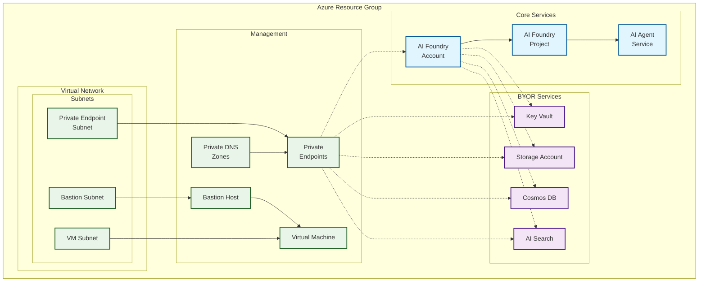

<!-- BEGIN_TF_DOCS -->
<!-- Code generated by terraform-docs. DO NOT EDIT. -->
# Private example

This example deploys a simple version of the module with private endpoints enabled.

## Architecture

This example deploys AI Foundry with private networking and supporting services:



**Components:**
- 🔷 **Core AI Foundry** with private access
- 🔶 **Supporting services** (Key Vault, Storage, Cosmos DB, AI Search)  
- 🔷 **Private networking** with VNet isolation and Bastion access
- All services connected via private endpoints for secure communication

```hcl
terraform {
  required_version = ">= 1.9, < 2.0"

  required_providers {
    azapi = {
      source  = "Azure/azapi"
      version = "~> 2.0"
    }
    azurerm = {
      source  = "hashicorp/azurerm"
      version = "~> 4.0"
    }
    random = {
      source  = "hashicorp/random"
      version = "~> 3.5"
    }
    time = {
      source  = "hashicorp/time"
      version = "~> 0.12"
    }
  }
}

provider "azurerm" {
  storage_use_azuread = true
  features {
    resource_group {
      prevent_deletion_if_contains_resources = false
    }
    virtual_machine {
      delete_os_disk_on_deletion = true
    }
    cognitive_account {
      purge_soft_delete_on_destroy = true
    }
  }
}

# Get current subscription data
data "azurerm_client_config" "current" {}

module "regions" {
  source  = "Azure/avm-utl-regions/azurerm"
  version = "0.5.2"

  availability_zones_filter = true
  geography_filter          = "Australia"
}

resource "random_shuffle" "locations" {
  input        = module.regions.valid_region_names
  result_count = 3
}

locals {
  base_name = "private"
}

module "naming" {
  source  = "Azure/naming/azurerm"
  version = "0.4.2"

  suffix        = [local.base_name]
  unique-length = 5
}

resource "azurerm_resource_group" "this" {
  location = random_shuffle.locations.result[0]
  name     = module.naming.resource_group.name_unique
}

# Virtual Network for private endpoints and agent services
resource "azurerm_virtual_network" "this" {
  location            = azurerm_resource_group.this.location
  name                = module.naming.virtual_network.name_unique
  resource_group_name = azurerm_resource_group.this.name
  address_space       = ["192.168.0.0/16"]
}

# Subnet for private endpoints
resource "azurerm_subnet" "private_endpoints" {
  address_prefixes     = ["192.168.1.0/24"]
  name                 = "snet-private-endpoints"
  resource_group_name  = azurerm_resource_group.this.name
  virtual_network_name = azurerm_virtual_network.this.name
}

# Subnet for AI agent services (Container Apps)
resource "azurerm_subnet" "agent_services" {
  address_prefixes     = ["192.168.0.0/24"]
  name                 = "snet-agent-services"
  resource_group_name  = azurerm_resource_group.this.name
  virtual_network_name = azurerm_virtual_network.this.name

  # Required for Container App Environment
  delegation {
    name = "Microsoft.App.environments"

    service_delegation {
      name    = "Microsoft.App/environments"
      actions = ["Microsoft.Network/virtualNetworks/subnets/join/action"]
    }
  }
}

# Subnet for Bastion
resource "azurerm_subnet" "bastion" {
  address_prefixes     = ["192.168.2.0/26"]
  name                 = "AzureBastionSubnet"
  resource_group_name  = azurerm_resource_group.this.name
  virtual_network_name = azurerm_virtual_network.this.name
}

# Subnet for VM
resource "azurerm_subnet" "vm" {
  address_prefixes     = ["192.168.3.0/26"]
  name                 = "snet-vm"
  resource_group_name  = azurerm_resource_group.this.name
  virtual_network_name = azurerm_virtual_network.this.name
}

# Storage Account Private DNS Zone
resource "azurerm_private_dns_zone" "storage_blob" {
  name                = "privatelink.blob.core.windows.net"
  resource_group_name = azurerm_resource_group.this.name
}

resource "azurerm_private_dns_zone_virtual_network_link" "storage_blob" {
  name                  = "vnet-link-storage-blob"
  private_dns_zone_name = azurerm_private_dns_zone.storage_blob.name
  resource_group_name   = azurerm_resource_group.this.name
  virtual_network_id    = azurerm_virtual_network.this.id
}

# Key Vault Private DNS Zone
resource "azurerm_private_dns_zone" "keyvault" {
  name                = "privatelink.vaultcore.azure.net"
  resource_group_name = azurerm_resource_group.this.name
}

resource "azurerm_private_dns_zone_virtual_network_link" "keyvault" {
  name                  = "vnet-link-keyvault"
  private_dns_zone_name = azurerm_private_dns_zone.keyvault.name
  resource_group_name   = azurerm_resource_group.this.name
  virtual_network_id    = azurerm_virtual_network.this.id
}

# Cosmos DB Private DNS Zone
resource "azurerm_private_dns_zone" "cosmosdb" {
  name                = "privatelink.documents.azure.com"
  resource_group_name = azurerm_resource_group.this.name
}

resource "azurerm_private_dns_zone_virtual_network_link" "cosmosdb" {
  name                  = "vnet-link-cosmosdb"
  private_dns_zone_name = azurerm_private_dns_zone.cosmosdb.name
  resource_group_name   = azurerm_resource_group.this.name
  virtual_network_id    = azurerm_virtual_network.this.id
}

# AI Search Private DNS Zone
resource "azurerm_private_dns_zone" "search" {
  name                = "privatelink.search.windows.net"
  resource_group_name = azurerm_resource_group.this.name
}

resource "azurerm_private_dns_zone_virtual_network_link" "search" {
  name                  = "vnet-link-search"
  private_dns_zone_name = azurerm_private_dns_zone.search.name
  resource_group_name   = azurerm_resource_group.this.name
  virtual_network_id    = azurerm_virtual_network.this.id
}

# Cognitive Services Private DNS Zone
resource "azurerm_private_dns_zone" "openai" {
  name                = "privatelink.openai.azure.com"
  resource_group_name = azurerm_resource_group.this.name
}

resource "azurerm_private_dns_zone_virtual_network_link" "openai" {
  name                  = "vnet-link-openai"
  private_dns_zone_name = azurerm_private_dns_zone.openai.name
  resource_group_name   = azurerm_resource_group.this.name
  virtual_network_id    = azurerm_virtual_network.this.id
}

# Cognitive Services General Private DNS Zone
resource "azurerm_private_dns_zone" "cognitiveservices" {
  name                = "privatelink.cognitiveservices.azure.com"
  resource_group_name = azurerm_resource_group.this.name
}

resource "azurerm_private_dns_zone_virtual_network_link" "cognitiveservices" {
  name                  = "vnet-link-cognitiveservices"
  private_dns_zone_name = azurerm_private_dns_zone.cognitiveservices.name
  resource_group_name   = azurerm_resource_group.this.name
  virtual_network_id    = azurerm_virtual_network.this.id
}

# Storage File Private DNS Zone
resource "azurerm_private_dns_zone" "storage_file" {
  name                = "privatelink.file.core.windows.net"
  resource_group_name = azurerm_resource_group.this.name
}

resource "azurerm_private_dns_zone_virtual_network_link" "storage_file" {
  name                  = "vnet-link-storage-file"
  private_dns_zone_name = azurerm_private_dns_zone.storage_file.name
  resource_group_name   = azurerm_resource_group.this.name
  virtual_network_id    = azurerm_virtual_network.this.id
}

# AI Services Private DNS Zone
resource "azurerm_private_dns_zone" "ai_services" {
  name                = "privatelink.services.ai.azure.com"
  resource_group_name = azurerm_resource_group.this.name
}

resource "azurerm_private_dns_zone_virtual_network_link" "ai_services" {
  name                  = "vnet-link-ai-services"
  private_dns_zone_name = azurerm_private_dns_zone.ai_services.name
  resource_group_name   = azurerm_resource_group.this.name
  virtual_network_id    = azurerm_virtual_network.this.id
}

# Bastion Host
resource "azurerm_public_ip" "example" {
  allocation_method   = "Static"
  location            = azurerm_resource_group.this.location
  name                = module.naming.public_ip.name_unique
  resource_group_name = azurerm_resource_group.this.name
  sku                 = "Standard"
  zones               = [1, 2, 3]
}

module "bastion_host" {
  source  = "Azure/avm-res-network-bastionhost/azurerm"
  version = "0.8.0"

  location            = azurerm_resource_group.this.location
  name                = module.naming.bastion_host.name_unique
  resource_group_name = azurerm_resource_group.this.name
  ip_configuration = {
    name                 = "default-ipconfig"
    subnet_id            = azurerm_subnet.bastion.id
    public_ip_address_id = azurerm_public_ip.example.id
    create_public_ip     = false
  }
  scale_units            = 2
  shareable_link_enabled = true
  sku                    = "Standard"
}

module "virtual_machine" {
  source  = "Azure/avm-res-compute-virtualmachine/azurerm"
  version = "0.19.3"

  location = azurerm_resource_group.this.location
  name     = module.naming.virtual_machine.name_unique
  network_interfaces = {
    network_interface_1 = {
      name = "${module.naming.network_interface.name_unique}-vm"
      ip_configurations = {
        ip_configuration_1 = {
          name                          = "internal"
          private_ip_subnet_resource_id = azurerm_subnet.vm.id
        }
      }
    }
  }
  resource_group_name                                    = azurerm_resource_group.this.name
  zone                                                   = "1"
  admin_username                                         = "azureadmin"
  bypass_platform_safety_checks_on_user_schedule_enabled = false
  disable_password_authentication                        = false
  os_disk = {
    caching              = "ReadWrite"
    storage_account_type = "Premium_LRS"
  }
  patch_assessment_mode = "AutomaticByPlatform"
  patch_mode            = "AutomaticByPlatform"
  sku_size              = "Standard_D4s_v3"
  source_image_reference = {
    publisher = "MicrosoftWindowsServer"
    offer     = "WindowsServer"
    sku       = "2022-datacenter-g2"
    version   = "latest"
  }
  tags = {}
}

# This is the module call for AI Foundry Pattern - Standard Private Configuration
module "ai_foundry" {
  source = "../../"

  base_name                  = local.base_name
  location                   = azurerm_resource_group.this.location
  resource_group_resource_id = azurerm_resource_group.this.id
  ai_foundry = {
    create_ai_agent_service       = true
    name                          = module.naming.cognitive_account.name_unique
    private_dns_zone_resource_ids = [azurerm_private_dns_zone.openai.id, azurerm_private_dns_zone.cognitiveservices.id, azurerm_private_dns_zone.ai_services.id]
    network_injections = [{
      scenario                   = "agent"
      subnetArmId                = azurerm_subnet.agent_services.id
      useMicrosoftManagedNetwork = false
    }]
  }
  ai_model_deployments = {
    "gpt-4o" = {
      name = "gpt-4.1"
      model = {
        format  = "OpenAI"
        name    = "gpt-4.1"
        version = "2025-04-14"
      }
      scale = {
        type     = "GlobalStandard"
        capacity = 1
      }
    }
  }
  ai_projects = {
    project_1 = {
      name                       = "project-1"
      description                = "Project 1 description"
      display_name               = "Project 1 Display Name"
      create_project_connections = true
      cosmos_db_connection = {
        new_resource_map_key = "this"
      }
      ai_search_connection = {
        new_resource_map_key = "this"
      }
      storage_account_connection = {
        new_resource_map_key = "this"
      }
    }
  }
  ai_search_definition = {
    this = {
      private_dns_zone_resource_id = azurerm_private_dns_zone.search.id
      enable_diagnostic_settings   = false
    }
  }
  cosmosdb_definition = {
    this = {
      private_dns_zone_resource_id = azurerm_private_dns_zone.cosmosdb.id
      enable_diagnostic_settings   = false
      consistency_level            = "Session"
    }
  }
  create_byor              = true # default: false
  create_private_endpoints = true # default: false
  key_vault_definition = {
    this = {
      private_dns_zone_resource_id = azurerm_private_dns_zone.keyvault.id
      enable_diagnostic_settings   = false
    }
  }
  private_endpoint_subnet_resource_id = azurerm_subnet.private_endpoints.id
  storage_account_definition = {
    this = {
      enable_diagnostic_settings = false
      endpoints = {
        blob = {
          private_dns_zone_resource_id = azurerm_private_dns_zone.storage_blob.id
          type                         = "blob"
        }
      }
    }
  }

  depends_on = [azapi_resource_action.purge_ai_foundry]
}

resource "azapi_resource_action" "purge_ai_foundry" {
  method      = "DELETE"
  resource_id = "/subscriptions/${data.azurerm_client_config.current.subscription_id}/providers/Microsoft.CognitiveServices/locations/${azurerm_resource_group.this.location}/resourceGroups/${azurerm_resource_group.this.name}/deletedAccounts/${module.naming.cognitive_account.name_unique}"
  #type        = "Microsoft.CognitiveServices/locations/resourceGroups/deletedAccounts@2025-09-01"
  type = "Microsoft.Resources/resourceGroups/deletedAccounts@2025-09-01"
  when = "destroy"

  depends_on = [time_sleep.purge_ai_foundry_cooldown]
}

resource "time_sleep" "purge_ai_foundry_cooldown" {
  destroy_duration = "900s" # 10m

  depends_on = [azurerm_subnet.agent_services]
}

```

<!-- markdownlint-disable MD033 -->
## Requirements

The following requirements are needed by this module:

- <a name="requirement_terraform"></a> [terraform](#requirement\_terraform) (>= 1.9, < 2.0)

- <a name="requirement_azapi"></a> [azapi](#requirement\_azapi) (~> 2.0)

- <a name="requirement_azurerm"></a> [azurerm](#requirement\_azurerm) (~> 4.0)

- <a name="requirement_random"></a> [random](#requirement\_random) (~> 3.5)

- <a name="requirement_time"></a> [time](#requirement\_time) (~> 0.12)

## Resources

The following resources are used by this module:

- [azapi_resource_action.purge_ai_foundry](https://registry.terraform.io/providers/Azure/azapi/latest/docs/resources/resource_action) (resource)
- [azurerm_private_dns_zone.ai_services](https://registry.terraform.io/providers/hashicorp/azurerm/latest/docs/resources/private_dns_zone) (resource)
- [azurerm_private_dns_zone.cognitiveservices](https://registry.terraform.io/providers/hashicorp/azurerm/latest/docs/resources/private_dns_zone) (resource)
- [azurerm_private_dns_zone.cosmosdb](https://registry.terraform.io/providers/hashicorp/azurerm/latest/docs/resources/private_dns_zone) (resource)
- [azurerm_private_dns_zone.keyvault](https://registry.terraform.io/providers/hashicorp/azurerm/latest/docs/resources/private_dns_zone) (resource)
- [azurerm_private_dns_zone.openai](https://registry.terraform.io/providers/hashicorp/azurerm/latest/docs/resources/private_dns_zone) (resource)
- [azurerm_private_dns_zone.search](https://registry.terraform.io/providers/hashicorp/azurerm/latest/docs/resources/private_dns_zone) (resource)
- [azurerm_private_dns_zone.storage_blob](https://registry.terraform.io/providers/hashicorp/azurerm/latest/docs/resources/private_dns_zone) (resource)
- [azurerm_private_dns_zone.storage_file](https://registry.terraform.io/providers/hashicorp/azurerm/latest/docs/resources/private_dns_zone) (resource)
- [azurerm_private_dns_zone_virtual_network_link.ai_services](https://registry.terraform.io/providers/hashicorp/azurerm/latest/docs/resources/private_dns_zone_virtual_network_link) (resource)
- [azurerm_private_dns_zone_virtual_network_link.cognitiveservices](https://registry.terraform.io/providers/hashicorp/azurerm/latest/docs/resources/private_dns_zone_virtual_network_link) (resource)
- [azurerm_private_dns_zone_virtual_network_link.cosmosdb](https://registry.terraform.io/providers/hashicorp/azurerm/latest/docs/resources/private_dns_zone_virtual_network_link) (resource)
- [azurerm_private_dns_zone_virtual_network_link.keyvault](https://registry.terraform.io/providers/hashicorp/azurerm/latest/docs/resources/private_dns_zone_virtual_network_link) (resource)
- [azurerm_private_dns_zone_virtual_network_link.openai](https://registry.terraform.io/providers/hashicorp/azurerm/latest/docs/resources/private_dns_zone_virtual_network_link) (resource)
- [azurerm_private_dns_zone_virtual_network_link.search](https://registry.terraform.io/providers/hashicorp/azurerm/latest/docs/resources/private_dns_zone_virtual_network_link) (resource)
- [azurerm_private_dns_zone_virtual_network_link.storage_blob](https://registry.terraform.io/providers/hashicorp/azurerm/latest/docs/resources/private_dns_zone_virtual_network_link) (resource)
- [azurerm_private_dns_zone_virtual_network_link.storage_file](https://registry.terraform.io/providers/hashicorp/azurerm/latest/docs/resources/private_dns_zone_virtual_network_link) (resource)
- [azurerm_public_ip.example](https://registry.terraform.io/providers/hashicorp/azurerm/latest/docs/resources/public_ip) (resource)
- [azurerm_resource_group.this](https://registry.terraform.io/providers/hashicorp/azurerm/latest/docs/resources/resource_group) (resource)
- [azurerm_subnet.agent_services](https://registry.terraform.io/providers/hashicorp/azurerm/latest/docs/resources/subnet) (resource)
- [azurerm_subnet.bastion](https://registry.terraform.io/providers/hashicorp/azurerm/latest/docs/resources/subnet) (resource)
- [azurerm_subnet.private_endpoints](https://registry.terraform.io/providers/hashicorp/azurerm/latest/docs/resources/subnet) (resource)
- [azurerm_subnet.vm](https://registry.terraform.io/providers/hashicorp/azurerm/latest/docs/resources/subnet) (resource)
- [azurerm_virtual_network.this](https://registry.terraform.io/providers/hashicorp/azurerm/latest/docs/resources/virtual_network) (resource)
- [random_shuffle.locations](https://registry.terraform.io/providers/hashicorp/random/latest/docs/resources/shuffle) (resource)
- [time_sleep.purge_ai_foundry_cooldown](https://registry.terraform.io/providers/hashicorp/time/latest/docs/resources/sleep) (resource)
- [azurerm_client_config.current](https://registry.terraform.io/providers/hashicorp/azurerm/latest/docs/data-sources/client_config) (data source)

<!-- markdownlint-disable MD013 -->
## Required Inputs

No required inputs.

## Optional Inputs

No optional inputs.

## Outputs

No outputs.

## Modules

The following Modules are called:

### <a name="module_ai_foundry"></a> [ai\_foundry](#module\_ai\_foundry)

Source: ../../

Version:

### <a name="module_bastion_host"></a> [bastion\_host](#module\_bastion\_host)

Source: Azure/avm-res-network-bastionhost/azurerm

Version: 0.8.0

### <a name="module_naming"></a> [naming](#module\_naming)

Source: Azure/naming/azurerm

Version: 0.4.2

### <a name="module_regions"></a> [regions](#module\_regions)

Source: Azure/avm-utl-regions/azurerm

Version: 0.5.2

### <a name="module_virtual_machine"></a> [virtual\_machine](#module\_virtual\_machine)

Source: Azure/avm-res-compute-virtualmachine/azurerm

Version: 0.19.3

<!-- markdownlint-disable-next-line MD041 -->
## Data Collection

The software may collect information about you and your use of the software and send it to Microsoft. Microsoft may use this information to provide services and improve our products and services. You may turn off the telemetry as described in the repository. There are also some features in the software that may enable you and Microsoft to collect data from users of your applications. If you use these features, you must comply with applicable law, including providing appropriate notices to users of your applications together with a copy of Microsoft’s privacy statement. Our privacy statement is located at <https://go.microsoft.com/fwlink/?LinkID=824704>. You can learn more about data collection and use in the help documentation and our privacy statement. Your use of the software operates as your consent to these practices.
<!-- END_TF_DOCS -->