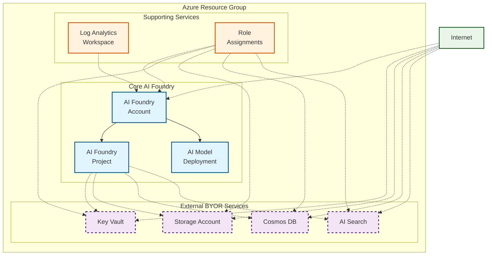

<!-- BEGIN_TF_DOCS -->
<!-- Code generated by terraform-docs. DO NOT EDIT. -->
# Public example

This deploys a simple version of the module without private endpoints.

## Architecture

This example uses externally created BYOR services with AI Foundry using public access:



**Components:**
- 🔷 **Core AI Foundry** (Account, Project, Model Deployment)
- 🔶 **External BYOR Services** (Key Vault, Storage, Cosmos DB, AI Search) - dashed borders indicate external resources
- 🔸 **Supporting Services** (Log Analytics, Role Assignments)
- 🔷 **Public Access** - All services accessible from the internet

This configuration demonstrates the BYOR (Bring Your Own Resources) pattern where supporting services are created and managed externally, then connected to the AI Foundry deployment.

```hcl
terraform {
  required_version = ">= 1.9, < 2.0"

  required_providers {
    azapi = {
      source  = "Azure/azapi"
      version = "~> 2.0"
    }
    azurerm = {
      source  = "hashicorp/azurerm"
      version = "~> 4.0"
    }
    random = {
      source  = "hashicorp/random"
      version = "~> 3.5"
    }
  }
}

provider "azurerm" {
  storage_use_azuread = true
  features {
    resource_group {
      prevent_deletion_if_contains_resources = false
    }
  }
}

locals {
  base_name = "pubbyor"
}

data "azurerm_client_config" "current" {}

module "regions" {
  source  = "Azure/avm-utl-regions/azurerm"
  version = "0.5.2"

  availability_zones_filter = true
  geography_filter          = "Australia"
}

resource "random_shuffle" "locations" {
  input        = module.regions.valid_region_names
  result_count = 3
}

module "naming" {
  source  = "Azure/naming/azurerm"
  version = "0.4.2"

  suffix        = [local.base_name]
  unique-length = 5
}

resource "azurerm_resource_group" "this" {
  location = random_shuffle.locations.result[0]
  name     = module.naming.resource_group.name_unique
}

resource "azurerm_log_analytics_workspace" "this" {
  location            = azurerm_resource_group.this.location
  name                = module.naming.log_analytics_workspace.name_unique
  resource_group_name = azurerm_resource_group.this.name
  retention_in_days   = 30
  sku                 = "PerGB2018"
}

# BYOR
## TODO: Add diagnostic settings to each BYOR resource

resource "azapi_resource" "ai_search" {
  location  = azurerm_resource_group.this.location
  name      = module.naming.search_service.name_unique
  parent_id = azurerm_resource_group.this.id
  type      = "Microsoft.Search/searchServices@2024-06-01-preview"
  body = {
    sku = {
      name = "standard"
    }

    identity = {
      type = "SystemAssigned"
    }

    properties = {

      # Search-specific properties
      replicaCount   = 2
      partitionCount = 1
      hostingMode    = "default"
      semanticSearch = "disabled"

      # Identity-related controls
      disableLocalAuth = false
      authOptions = {
        aadOrApiKey = {
          aadAuthFailureMode = "http401WithBearerChallenge"
        }
      }
      # Networking-related controls
      publicNetworkAccess = "Enabled"
      networkRuleSet = {
        bypass = "None"
      }
    }
  }
  schema_validation_enabled = true
}

module "key_vault" {
  source  = "Azure/avm-res-keyvault-vault/azurerm"
  version = "0.10.0"

  location                        = azurerm_resource_group.this.location
  name                            = module.naming.key_vault.name_unique
  resource_group_name             = azurerm_resource_group.this.name
  tenant_id                       = data.azurerm_client_config.current.tenant_id
  enabled_for_deployment          = true
  enabled_for_disk_encryption     = true
  enabled_for_template_deployment = true
  network_acls = {
    default_action = "Allow"
    bypass         = "AzureServices"
  }
}

module "storage_account" {
  source  = "Azure/avm-res-storage-storageaccount/azurerm"
  version = "0.6.3"

  location                 = azurerm_resource_group.this.location
  name                     = module.naming.storage_account.name_unique
  resource_group_name      = azurerm_resource_group.this.name
  access_tier              = "Hot"
  account_kind             = "StorageV2"
  account_replication_type = "ZRS"
  account_tier             = "Standard"
}

module "cosmosdb" {
  source  = "Azure/avm-res-documentdb-databaseaccount/azurerm"
  version = "0.8.0"

  location                   = azurerm_resource_group.this.location
  name                       = module.naming.cosmosdb_account.name_unique
  resource_group_name        = azurerm_resource_group.this.name
  analytical_storage_enabled = true
  automatic_failover_enabled = true
  capacity = {
    total_throughput_limit = -1
  }
  consistency_policy = {
    consistency_level       = "Session"
    max_interval_in_seconds = 300
    max_staleness_prefix    = 100001
  }
  ip_range_filter = [
    "168.125.123.255",
    "170.0.0.0/24",                                                                 #TODO: check 0.0.0.0 for validity
    "0.0.0.0",                                                                      #Accept connections from within public Azure datacenters. https://learn.microsoft.com/en-us/azure/cosmos-db/how-to-configure-firewall#allow-requests-from-the-azure-portal
    "104.42.195.92", "40.76.54.131", "52.176.6.30", "52.169.50.45", "52.187.184.26" #Allow access from the Azure portal. https://learn.microsoft.com/en-us/azure/cosmos-db/how-to-configure-firewall#allow-requests-from-global-azure-datacenters-or-other-sources-within-azure
  ]
  local_authentication_disabled         = true
  multiple_write_locations_enabled      = false
  network_acl_bypass_for_azure_services = true
  partition_merge_enabled               = false
  public_network_access_enabled         = true
}

module "ai_foundry" {
  source = "../../"

  base_name                  = local.base_name
  location                   = azurerm_resource_group.this.location
  resource_group_resource_id = azurerm_resource_group.this.id
  ai_foundry = {
    create_ai_agent_service = true
    name                    = module.naming.cognitive_account.name_unique
  }
  ai_model_deployments = {
    "gpt-4o" = {
      name = "gpt-4.1"
      model = {
        format  = "OpenAI"
        name    = "gpt-4.1"
        version = "2025-04-14"
      }
      scale = {
        type     = "GlobalStandard"
        capacity = 1
      }
    }
  }
  ai_projects = {
    project_1 = {
      name                       = "project-1"
      description                = "Project 1 description"
      display_name               = "Project 1 Display Name"
      create_project_connections = true
      cosmos_db_connection = {
        new_resource_map_key = "this"
        existing_resource_id = module.cosmosdb.resource_id
      }
      ai_search_connection = {
        new_resource_map_key = "this"
        existing_resource_id = azapi_resource.ai_search.id
      }
      storage_account_connection = {
        new_resource_map_key = "this"
        existing_resource_id = module.storage_account.resource_id
      }
    }
  }
  ai_search_definition = {
    this = {
      existing_resource_id       = azapi_resource.ai_search.id
      enable_diagnostic_settings = false
    }
  }
  cosmosdb_definition = {
    this = {
      existing_resource_id       = module.cosmosdb.resource_id
      enable_diagnostic_settings = false
    }
  }
  create_byor              = false # default: false
  create_private_endpoints = false # default: false
  key_vault_definition = {
    this = {
      existing_resource_id       = module.key_vault.resource_id
      enable_diagnostic_settings = false
    }
  }
  law_definition = {
    this = {
      existing_resource_id = azurerm_log_analytics_workspace.this.id
    }
  }
  storage_account_definition = {
    this = {
      existing_resource_id       = module.storage_account.resource_id
      enable_diagnostic_settings = false
    }
  }

  depends_on = [azapi_resource_action.purge_ai_foundry]
}

resource "azapi_resource_action" "purge_ai_foundry" {
  method      = "DELETE"
  resource_id = "/subscriptions/${data.azurerm_client_config.current.subscription_id}/providers/Microsoft.CognitiveServices/locations/${azurerm_resource_group.this.location}/resourceGroups/${azurerm_resource_group.this.name}/deletedAccounts/${module.naming.cognitive_account.name_unique}"
  type        = "Microsoft.Resources/resourceGroups/deletedAccounts@2025-09-01"
  when        = "destroy"
}
```

<!-- markdownlint-disable MD033 -->
## Requirements

The following requirements are needed by this module:

- <a name="requirement_terraform"></a> [terraform](#requirement\_terraform) (>= 1.9, < 2.0)

- <a name="requirement_azapi"></a> [azapi](#requirement\_azapi) (~> 2.0)

- <a name="requirement_azurerm"></a> [azurerm](#requirement\_azurerm) (~> 4.0)

- <a name="requirement_random"></a> [random](#requirement\_random) (~> 3.5)

## Resources

The following resources are used by this module:

- [azapi_resource.ai_search](https://registry.terraform.io/providers/Azure/azapi/latest/docs/resources/resource) (resource)
- [azapi_resource_action.purge_ai_foundry](https://registry.terraform.io/providers/Azure/azapi/latest/docs/resources/resource_action) (resource)
- [azurerm_log_analytics_workspace.this](https://registry.terraform.io/providers/hashicorp/azurerm/latest/docs/resources/log_analytics_workspace) (resource)
- [azurerm_resource_group.this](https://registry.terraform.io/providers/hashicorp/azurerm/latest/docs/resources/resource_group) (resource)
- [random_shuffle.locations](https://registry.terraform.io/providers/hashicorp/random/latest/docs/resources/shuffle) (resource)
- [azurerm_client_config.current](https://registry.terraform.io/providers/hashicorp/azurerm/latest/docs/data-sources/client_config) (data source)

<!-- markdownlint-disable MD013 -->
## Required Inputs

No required inputs.

## Optional Inputs

No optional inputs.

## Outputs

No outputs.

## Modules

The following Modules are called:

### <a name="module_ai_foundry"></a> [ai\_foundry](#module\_ai\_foundry)

Source: ../../

Version:

### <a name="module_cosmosdb"></a> [cosmosdb](#module\_cosmosdb)

Source: Azure/avm-res-documentdb-databaseaccount/azurerm

Version: 0.8.0

### <a name="module_key_vault"></a> [key\_vault](#module\_key\_vault)

Source: Azure/avm-res-keyvault-vault/azurerm

Version: 0.10.0

### <a name="module_naming"></a> [naming](#module\_naming)

Source: Azure/naming/azurerm

Version: 0.4.2

### <a name="module_regions"></a> [regions](#module\_regions)

Source: Azure/avm-utl-regions/azurerm

Version: 0.5.2

### <a name="module_storage_account"></a> [storage\_account](#module\_storage\_account)

Source: Azure/avm-res-storage-storageaccount/azurerm

Version: 0.6.3

<!-- markdownlint-disable-next-line MD041 -->
## Data Collection

The software may collect information about you and your use of the software and send it to Microsoft. Microsoft may use this information to provide services and improve our products and services. You may turn off the telemetry as described in the repository. There are also some features in the software that may enable you and Microsoft to collect data from users of your applications. If you use these features, you must comply with applicable law, including providing appropriate notices to users of your applications together with a copy of Microsoft’s privacy statement. Our privacy statement is located at <https://go.microsoft.com/fwlink/?LinkID=824704>. You can learn more about data collection and use in the help documentation and our privacy statement. Your use of the software operates as your consent to these practices.
<!-- END_TF_DOCS -->