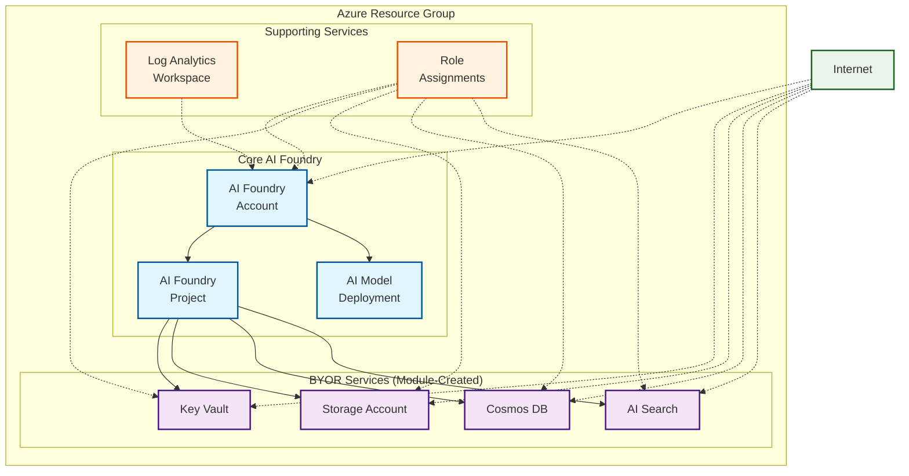

<!-- BEGIN_TF_DOCS -->
<!-- Code generated by terraform-docs. DO NOT EDIT. -->
# Public example

This deploys a simple version of the module without private endpoints.

## Architecture

This example deploys AI Foundry with all BYOR services using public access:



**Components:**
- 🔷 **Core AI Foundry** (Account, Project, Model Deployment)
- 🔶 **BYOR Services** created by the module (Key Vault, Storage, Cosmos DB, AI Search)
- 🔸 **Supporting Services** (Log Analytics, Role Assignments)
- 🔷 **Public Access** - All services accessible from the internet

This configuration provides a complete AI Foundry setup with supporting services while maintaining public accessibility for simplified access patterns.

```hcl
terraform {
  required_version = ">= 1.9, < 2.0"

  required_providers {
    azapi = {
      source  = "Azure/azapi"
      version = "~> 2.0"
    }
    azurerm = {
      source  = "hashicorp/azurerm"
      version = "~> 4.0"
    }
    random = {
      source  = "hashicorp/random"
      version = "~> 3.5"
    }
  }
}

provider "azurerm" {
  storage_use_azuread = true
  features {
    resource_group {
      prevent_deletion_if_contains_resources = false
    }
    cognitive_account {
      purge_soft_delete_on_destroy = true
    }
  }
}

data "azurerm_client_config" "current" {}

locals {
  base_name = "public"
}

module "regions" {
  source  = "Azure/avm-utl-regions/azurerm"
  version = "0.5.2"

  availability_zones_filter = true
  geography_filter          = "Australia"
}

resource "random_shuffle" "locations" {
  input        = module.regions.valid_region_names
  result_count = 3
}

module "naming" {
  source  = "Azure/naming/azurerm"
  version = "0.4.2"

  suffix        = [local.base_name]
  unique-length = 5
}

resource "azurerm_resource_group" "this" {
  location = random_shuffle.locations.result[0]
  name     = module.naming.resource_group.name_unique
}

resource "azurerm_log_analytics_workspace" "this" {
  location            = azurerm_resource_group.this.location
  name                = module.naming.log_analytics_workspace.name_unique
  resource_group_name = azurerm_resource_group.this.name
  retention_in_days   = 30
  sku                 = "PerGB2018"
}

module "ai_foundry" {
  source = "../../"

  base_name                  = local.base_name
  location                   = azurerm_resource_group.this.location
  resource_group_resource_id = azurerm_resource_group.this.id
  ai_foundry = {
    create_ai_agent_service = true
    name                    = module.naming.cognitive_account.name_unique
  }
  ai_model_deployments = {
    "gpt-4o" = {
      name = "gpt-4.1"
      model = {
        format  = "OpenAI"
        name    = "gpt-4.1"
        version = "2025-04-14"
      }
      scale = {
        type     = "GlobalStandard"
        capacity = 1
      }
    }
  }
  ai_projects = {
    project_1 = {
      name                       = "project-1"
      description                = "Project 1 description"
      display_name               = "Project 1 Display Name"
      create_project_connections = true
      cosmos_db_connection = {
        new_resource_map_key = "this"
      }
      ai_search_connection = {
        new_resource_map_key = "this"
      }
      storage_account_connection = {
        new_resource_map_key = "this"
      }
    }
  }
  ai_search_definition = {
    this = {
      enable_diagnostic_settings = false
    }
  }
  cosmosdb_definition = {
    this = {
      enable_diagnostic_settings = false
    }
  }
  create_byor              = true
  create_private_endpoints = false # default: false
  key_vault_definition = {
    this = {
      enable_diagnostic_settings = false
    }
  }
  storage_account_definition = {
    this = {
      enable_diagnostic_settings = false
    }
  }

  depends_on = [azapi_resource_action.purge_ai_foundry]
}

resource "azapi_resource_action" "purge_ai_foundry" {
  method      = "DELETE"
  resource_id = "/subscriptions/${data.azurerm_client_config.current.subscription_id}/providers/Microsoft.CognitiveServices/locations/${azurerm_resource_group.this.location}/resourceGroups/${azurerm_resource_group.this.name}/deletedAccounts/${module.naming.cognitive_account.name_unique}"
  type        = "Microsoft.Resources/resourceGroups/deletedAccounts@2025-09-01"
  when        = "destroy"
}
```

<!-- markdownlint-disable MD033 -->
## Requirements

The following requirements are needed by this module:

- <a name="requirement_terraform"></a> [terraform](#requirement\_terraform) (>= 1.9, < 2.0)

- <a name="requirement_azapi"></a> [azapi](#requirement\_azapi) (~> 2.0)

- <a name="requirement_azurerm"></a> [azurerm](#requirement\_azurerm) (~> 4.0)

- <a name="requirement_random"></a> [random](#requirement\_random) (~> 3.5)

## Resources

The following resources are used by this module:

- [azapi_resource_action.purge_ai_foundry](https://registry.terraform.io/providers/Azure/azapi/latest/docs/resources/resource_action) (resource)
- [azurerm_log_analytics_workspace.this](https://registry.terraform.io/providers/hashicorp/azurerm/latest/docs/resources/log_analytics_workspace) (resource)
- [azurerm_resource_group.this](https://registry.terraform.io/providers/hashicorp/azurerm/latest/docs/resources/resource_group) (resource)
- [random_shuffle.locations](https://registry.terraform.io/providers/hashicorp/random/latest/docs/resources/shuffle) (resource)
- [azurerm_client_config.current](https://registry.terraform.io/providers/hashicorp/azurerm/latest/docs/data-sources/client_config) (data source)

<!-- markdownlint-disable MD013 -->
## Required Inputs

No required inputs.

## Optional Inputs

No optional inputs.

## Outputs

No outputs.

## Modules

The following Modules are called:

### <a name="module_ai_foundry"></a> [ai\_foundry](#module\_ai\_foundry)

Source: ../../

Version:

### <a name="module_naming"></a> [naming](#module\_naming)

Source: Azure/naming/azurerm

Version: 0.4.2

### <a name="module_regions"></a> [regions](#module\_regions)

Source: Azure/avm-utl-regions/azurerm

Version: 0.5.2

<!-- markdownlint-disable-next-line MD041 -->
## Data Collection

The software may collect information about you and your use of the software and send it to Microsoft. Microsoft may use this information to provide services and improve our products and services. You may turn off the telemetry as described in the repository. There are also some features in the software that may enable you and Microsoft to collect data from users of your applications. If you use these features, you must comply with applicable law, including providing appropriate notices to users of your applications together with a copy of Microsoft’s privacy statement. Our privacy statement is located at <https://go.microsoft.com/fwlink/?LinkID=824704>. You can learn more about data collection and use in the help documentation and our privacy statement. Your use of the software operates as your consent to these practices.
<!-- END_TF_DOCS -->